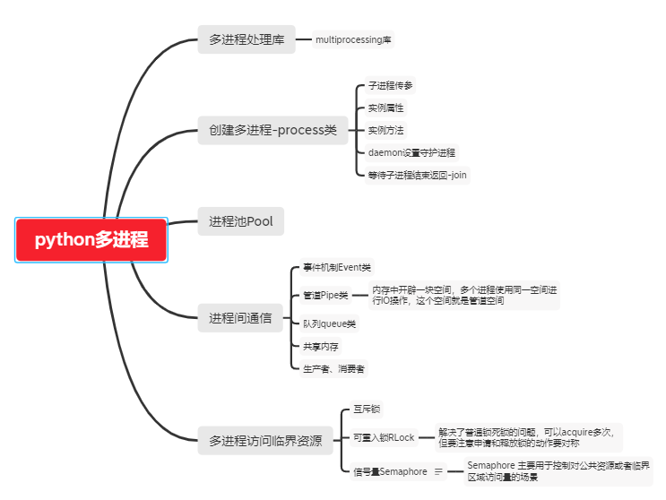
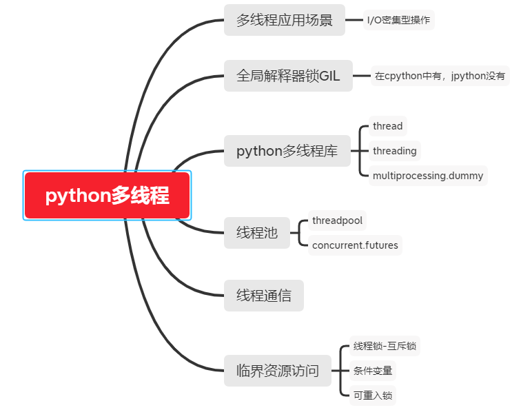
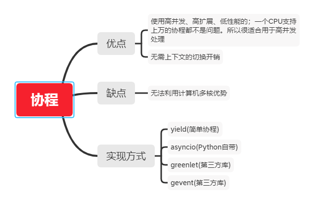

本文学习python并发编程与多线程







## 1. Python并发编程
如果想要充分利用CPU多核资源，做到多并发，需要Python多进程，只有Python多进程才能利用CPU多核资源，做到真正的多并发。
python多进程库：multiprocessing

## 2. python多线程
Python有一个全局解释器锁(GIL，全称Global Interpreter Lock)，用来保证同一时刻只有一个线程在使用CPU资源;当出现IO阻塞时，解锁，释放CPU资源，
其他线程才能申请到锁，使用CPU资源。因此Python多线程无法使用CPU多核资源。
python多线程编程使用的模块库有
thread，python内置，比较底层，不推荐使用
threading，python内置，使用较多
multiprocessing.dummy， Python内置，可以方便的将代码在多线程和多进程之间进行切换。

## 3. python多线程和多进程的应用场景
Python多线程和多进程有自己的应用场景：
python多线程，是利用了单个cpu的资源，适用于压力不在cpu，而在网络/io方面的应用，比如文件读写、网络数据传输等。

Python多线程适用于I/O密集型场景，如解决网络IO、磁盘IO阻塞问题，例如文件读写、网络数据传输等;
而Python多进程更适用于计算密集型场景，多并发，大量计算任务等。
注意：Python多线程和多进程在平时开发过程中，需要注意使用，如果使用Python多线程方式处理计算密集型任务，它比实际单进程处理性能还要慢!所以要注意，看场景类型。

## 4. 协程

## 5. 使用场景
- 多进程：适用于计算型的程序
- 多线程：适用于IO操作的程序
- 协程：适用于IO耗时较高的异步阻塞



