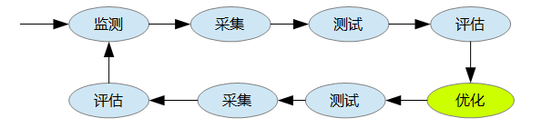
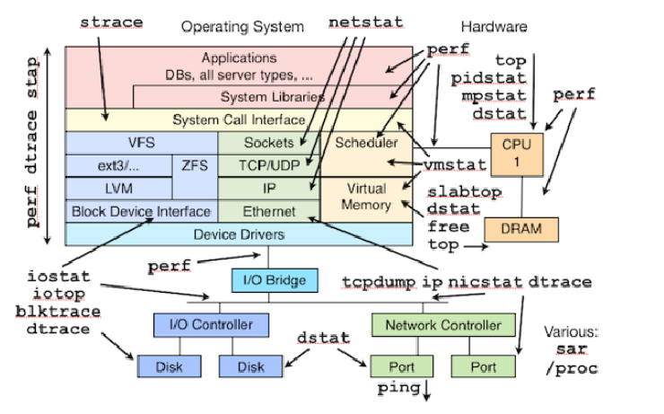

本文讨论KVM上性能调优问题。

```
一、优化过程
二、应用类型
三、监控工具
四、CPU
五、内存
六、网络
七、I/O
八、参考
```

## 一、优化过程
系统优化是一项复杂、繁琐、长期的工作，优化前需要监测、采集、测试、评估，优化后也需要测试、采集、评估、监测，而且是一个长期和持续的过程，
不是说现在优化了，测试了，以后就可以一劳永逸了，也不是说书本上的优化就适合眼下正在运行的系统，
不同的系统、不同的硬件、不同的应用优化的重点也不同、优化的方法也不同、优化的参数也不同。

性能监测是系统优化过程中重要的一环，如果没有监测、不清楚性能瓶颈在哪里，优化什么呢、怎么优化呢？所以找到性能瓶颈是性能监测的目的，也是系统优化的关键。
系统由若干子系统构成，通常修改一个子系统有可能影响到另外一个子系统，甚至会导致整个系统不稳定、崩溃。

所以说优化、监测、测试通常是连在一起的，而且是一个循环而且长期的过程。



通常监测的子系统有以下这些：

- CPU
- 内存
- 网络
- I/O

## 二、应用类型
- CPU 相关，CPU 相关的应用需要使用大量 CPU，比如高并发的 web/mail 服务器、图像/视频处理、科学计算等都可被视作 CPU 相关的应用；
- IO 相关，IO 相关的应用通常用来处理大量数据，需要大量内存和存储，频繁 IO 操作读写数据，而对 CPU 的要求则较少，大部分时候 CPU 都在等待硬盘，比如，数据库服务器、文件服务器等；

### 三、监控工具



## 四、CPU

### 1. CPU绑定
```
1) numactl -m 0 –physcpubind=2,3 numastat -c qemu-kvm
查看每个节点的内存统计:numatune
2)  taskset
3) Pin, 将vm上的CPU 绑定到某一个node上. 让其共享L3-cache. 优先选择node上的内存, bind方法可以通过 virt-manage processor里面的pinning动态绑定。这个绑定是实时生效的
```
**Note1:** 此方法仅仅进行CPU bind, 会共享l3-cache.并没有限制一定使用某一个node上的内存,所以仍然会出现跨node使用内存的情况.
**Note2:** NUMA调优的目标就是让处理器尽量的访问自己的存储器，以提高处理速度.

## 五、内存
Cache : L1, L2, L3. L1 还分为独立的指令cache和数据cache.

`ls /sys/devices/system/cpu/cpu0/cache/ index0 index1 index2 index3`

1级数据cache; 1级指令cache; 2级cache; 3级cache 对应cpuinfo中的cache

优化项包括: EPT, 透明大页, 内存碎片整理, ksm(Kernel Samepage Merging),cache policy

**NUMA Memory Policy**

NUMAM的内存分配策略有localalloc、preferred、membind、interleave. localalloc规定进程从当前node上请求分配内存；

- preferred比较宽松地指定了一个推荐的node来获取内存，如果被推荐的node上没有足够内存，进程可以尝试别的node
- membind可以指定若干个node，进程只能从这些指定的node上请求分配内存
- interleave规定进程从指定的若干个node上以RR算法 交织地请求分配内存

## 六、网络
## 七、磁盘I/O
优化包括: virtio-blk、缓存模式、aio、块设备io调度器 
## 八、参考
- [Linux 性能监测：介绍](https://linux.cn/article-1769-1.html)
- [Linux 性能监测：CPU](https://linux.cn/article-1770-1.html)
