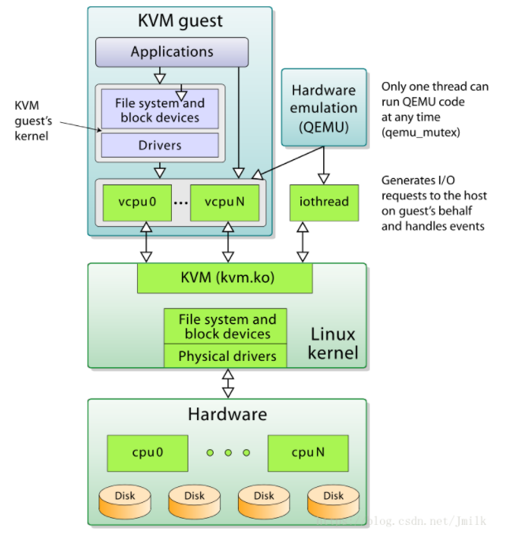
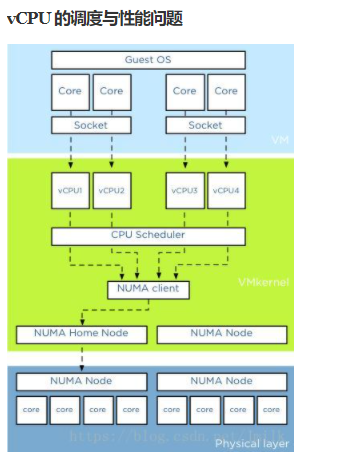
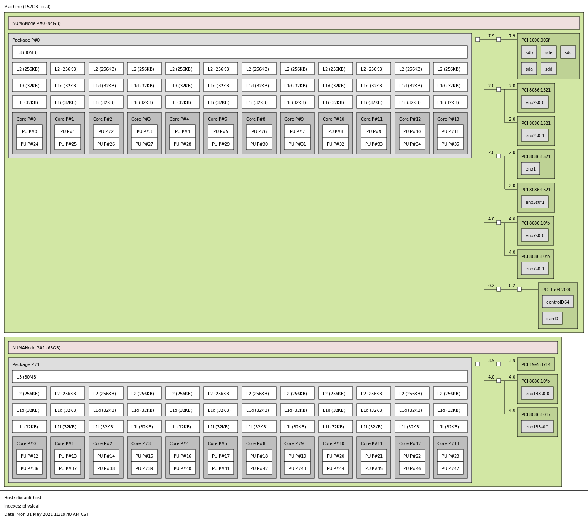
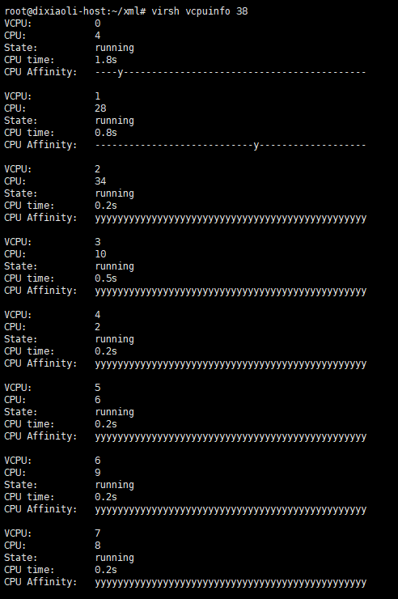
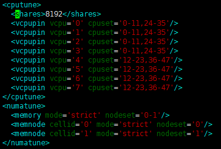
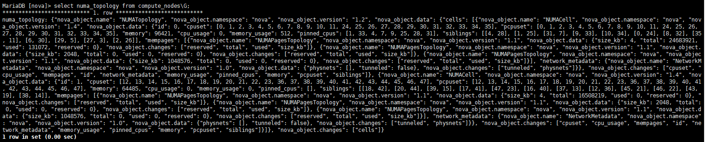

本文来讨论KVM上虚拟机cpu优化；
```
一、vCPU的调度与性能问题
二、NUMA架构
三、优化场景
四、如何优化
五、其它CPU优化
六、性能对比测试
七、virsh cpu操作
八、宿主机CPU信息查看
附：SMT、CMP、SMP
```
## 一、vCPU的调度与性能问题




提高虚拟机 vCPU 的性能，需要贯彻三点原则：

- 减少多线程上下文切换的性能损耗
- 减少用户线程模式切换的性能损耗
- 提高高速缓存的命中率

而实现这些原则的手段大致上有两种：

- 规划出给Guest专用的pCPUs，并且vCPUs和pCPUs所拥有的Cores数量相近
- 将vCPU绑定到指定的pCPU上运行

### 1.1 KVM CPU优化

- 开启vt，一般都开启了
- vcpu绑定
- CPU 热添加
当我们KVM 虚机上运行多个程序，cpu 负载不过来，可以通过热添加cpu 来分担负载。方法如下：
```
step1： 只有配置maxvcpu 个数才能热添加cpu ，而且添加得cpu 个数不能大于maxvcpu
step2: 执行热添加添加cpu个数，写入配置文件，永久保存 ：
virsh setvcpus test-vm 2 --live --config
step3： 检查虚拟机信息，cpu个数增长
virsh dominfo test-vm
```
- numa 调优
```
使用numactl  --hardware 可以看到cpu的硬件情况；
使用numastat命令可以查看每个节点的内存统计；
numastat -c  qemu-kvm：可以查看相关进程的内存使用情况
```
## 二、NUMA架构

查看本机numa架构:
```
sudo apt install hwloc
lstopo --of pdf server.pdf
lstopo --of png > server.png
```


系统 boot 的时候，硬件会把 numa 信息发送给 os，如果系统支持 numa，会发生以下几件事：

- 获取 numa 配置信息
- 将 processors（不是 cores） 分成很多 nodes，一般是一个 processor 一个 node。
- 将 processor 附近的 memory 分配给它。
- 计算node 间通信的cost（距离）。

如果你只是把 CPU 和内存当作是黑盒子，简单地期待它 work 的话，可能会发生意想不到的事情。

- 每个进程、线程都会继承一个 numa policy，定义了可以使用那些CPU（甚至是那些 core），哪些内存可以使用，以及 policy 的强制程度，即是优先还是强制性只允许。
- 每个 thread 被分配到了一个”优先” 的 node 上面运行，thread 可以在其他地方运行（如果 policy 允许的话），但是 os 会尝试让他在优先地 node 上面去运行。
- 内存分配：默认内存从同一个 node 里面进行分配。
- 在一个 node 上面分配地内存不会被移动到其他node。

Linux 有一个 numa policy，这个是可以人为控制的。

- —localalloc ，使用当前 node，默认。
- --preferred=node，优先实用指定的 node，实在不行用其他的 nod 也可以。
- --membind=nodes，总是使用人为指定一个或多个 nodes。
- --interleaved=all，采用round-robin算法轮流使用不同的 node。

## 三、优化场景
```
(1) 查看numastate，当numa_miss和numa_foregin 较高，则需要绑定
(2) 大flavor虚拟机
If the memory/vCPUs associated with a flavor are larger than any single NUMA node, it is important to 
expose NUMA topology to the guest so that the OS in the guest can intelligently schedule workloads it runs. For this to work the guest NUMA nodes must be
directly associated with host NUMA nodes.
(3) 系统的 CPU 压力较大
(4) 多核 cpu 压力不平衡，可以通过 cpu vcpupin 技术人工进行调配。
```

## 四、如何优化

1. 修改nova.conf

预留CPU个数和内存需要根据实际情况调整，比如若计算节点和存储节点融合，则需要预留更多的CPU来保证存储服务的性能。

`vcpu_pin_set = 4-12,^8,15   #Presumably, this would ensure that all instances only run on CPUs 4,5,6,7,9,10,11,12,15`

为了让用户一方面可以划分出 Guest 专用的 pCPUs 以保证性能，另一方面也是为了防止 Guest 过分争抢 Host 进程的 CPU 资源，为 Host 适当的留下一些 CPU 以保证正常运作

该配置只是针对用户态进程，若用户态进程空闲，则分配的cpu还是会跑内核态的任务。

`reserved_host_memory_mb = 4096`

如果需要配置虚拟机CPU独占，则还需要配置内核参数isolcpu来限制其他进程使用指定的CPU。比如我们需要把CPU 2,3,6,7作为CPU pinning给虚拟机独占，设置如下:

`grubby --update-kernel=ALL --args="isolcpus=2,3,6,7"`

重新安装grub:

`grub2-install /dev/sda`

重启宿主机: `reboot`

2. vcpupin

目前openstack nova支持 NUMA 体系结构亲和支持 CPU 亲和性。

开启 NUMATopologyFilter

Nova支持vcpupin，通过设置nova flavor或者glance image的元数据来实现，由用户指定绑定选项dedicated，并制定绑定策略，由nova来通过一系列调度具体选择绑定某个vcpu到某一pcpu上。支持以下设置项

使用方法一般是建两个host-aggregate，一个叫cpu_pinning，一个叫normal，两个aggregate加入不同物理机，有绑定需求的虚机使用cpu_pinning这个aggregate中的物理机建虚机。不会将有绑定需求和没有绑定需求的cpu放在同一个物理机上；

**在T版以后，以后支持了将两种虚拟机放在同一物理机上：**
```
Prior to 20.0.0 (Train), it was not necessary to explicitly configure hosts for pinned instances. However, it was not possible to place pinned instances on the same host as unpinned CPUs,
which typically meant hosts had to be grouped into host aggregates. If this was not done, unpinned instances would continue floating across all enabled host CPUs,
even those that some instance CPUs were pinned to. Starting in 20.0.0, it is necessary to explicitly identify the host cores that should be used for pinned instances.

[DEFAULT]
cpu_allocation_ratio=8.0

[compute]
cpu_dedicated_set=2-17
cpu_shared_set=18-47
```

| 参数 | 含义 |  合法值 | NOTE | 
|-----|-----|---------|------|
| hw:cpu_policy | determine whether an instance should be pinned or not  | shared//默认值，不绑定，dedicated//绑定 | shared: 不独占 pCPU 策略，允许 vCPUs 在不同的 pCPUs 间浮动，尽管 vCPUs 受到 NUMA node 的限制也是如此。 dedicated: 独占 pCPU 策略，Guest 的 vCPUs 将会严格的 pinned 到 pCPUs 的集合中。在没有明确配置 Guest NUMA Topology 的情况下，Nova 会将每个 vCPU 都作为一个 Socket 中的一个 Core；如果已经明确的配置了 Guest NUMA Topology 的话，那么虚拟机就会严格按照 Guest NUMA Topology 和 Host NUMA Topology 的映射关系将 vCPUs pinned to pCPUs，pCPUs 可能是一个 Core 或是一个 Thread，根据 Host 实际的处理器体系结构以及 CPU-THREAD-POLICY 来共同决定。此时的 CPU overcommit ratio 为 1.0（不支持 CPU 超配），避免 vCPU 的数量大于 Core 的数量导致的线程上下文切换损耗。 |
| hw:cpu_thread_policy | Customizing instance CPU thread pinning policies | prefer/isolate/require | prefer (default)：如果 Host 开启了超线程，则 vCPU 优先选择在 Siblings Thread 中运行，即所有的 vCPU 都只会考虑 siblings。例如：4 个逻辑核属于同一 NUMA，其中 CPU1 和 CPU2 属于相同物理核，CPU3 和 CPU4 属于不同的物理核，若此时创建一个 Flavor vCPU 为 4 的云主机会创建失败，因为 siblings 只有 [set([1, 2])]；否则，vCPU 优先选择在 Core 上运行。isolate（vCPU 性能最好）：vCPU 必须绑定到 Core 上。如果 Host 没有开启超线程，则理所当然会将 vCPU 绑定到 Core 上；相反，如果 Host 开启了超线程，则 vCPU 会被绑定到 Siblings Thread 的一个 Thread 中，并且其他的 vCPU 不会再被分配到该 Core 上，相当于 vCPU 独占一个 Core，避免 Siblings Thread 竞争。require（vCPU 数量最多）：vCPU 必须绑定到 Thread 上。Host 必须开启超线程，每个 vCPU 都会被绑定到 Thread 上，直到 Thread 用完为止。如果没有开启的话，那么该 Host 不会出现在 Nova Scheduler 的调度名单中。
| hw:emulator_threads_policy | Customizing instance emulator thread pinning policies  | |for things like real-time instances, it may not be acceptable for emulator thread to steal time from instance CPUs. | 
| hw:numa_nodes=1/2|  To restrict an instance's vCPUs to a single host NUMA node | | Customizing instance NUMA placement policies |
|hw:numa_mem | | | |
| hw:numa_cpus.N |  | | |
| hw:cpu_sockets hw:cpu_threads hw:cpu_cores | | |  Customizing instance CPU topologies |
| <vcpusched vcpus="0-3" scheduler="fifo" priority="1"/> | | | set_vcpu_realtime_scheduler create these elements for real-time instances and 'fifo' is the only scheduler policy we currently support |

Note:
It is not currently possible to request ``PCPU`` and ``VCPU`` resources in the same instance
```
openstack flavor set  dixiaoli-flavor  --property hw:cpu_policy=dedicated/share --property hw:cpu_thread_policy=isolate/prefer/require
openstack flavor set --property hw:numa_nodes=1 dixiaoli-flavor  //To restrict an instance's vCPUs to a single host NUMA node
openstack flavor set --property hw:numa_nodes=2 dixiaoli-flavor // To force an instance's vCPUs to spread across two host NUMA nodes
openstack flavor set dixiaoli-flavor --property hw:numa_mem.0=215
openstack flavor set dixiaoli-flavor --property hw:cpu_max_sockets=1
```
创建出来vcpu 绑定的guest vm，xml如下：
```
<vcpu placement='static' cpuset='2-3'>2</vcpu>
      <cputune>
        <vcpupin vcpu='0' cpuset='2'/>
        <vcpupin vcpu='1' cpuset='3'/>
      </cputune>
```





NOTE 1：只有设定 `hw:cpu_policy=dedicated` 时，`hw:cpu_thread_policy` 才会生效。后者设定的是 vCPU pinning to pCPU 的策略。

NOTE 2：如果 pinned（isolate） 和 unpinned 的虚拟机运行在同一个 compute node，则会发生 CPU 竞争，因为 unpinned 的虚拟机不会考虑到 pinned 虚拟机的资源需求，由于 Cache 的影响，这将会严重的影响进行了 CPU 绑定的虚拟机的性能，尤其当两者同处一个 NUMA 节点时。所以，应该使用 Host Aggregate 来区分开 pinned 和 unpinned 的虚拟机，退一步来说，最起码也应该让两者运行在不同的 NUMA 节点上。而且如果一个 compute node 上运行的全是 pinned 虚拟机，那么这个 compute node 不建议配置超配比。

NOTE 3：如果 cpu_thread_policy=prefer | require 时，Nova 的 Thread 分配策略是尽量先占满一个 Core，然后再使用下一个 Core 上的 Thread，尽量避免 Thread/Core 碎片影响到后面创建的虚拟机。

查看cpupin情况：



3. vcpupin对迁移、疏散的影响

## 五：其他cpu优化

taskset和vcpupin区别

Taskset是以task（也就是虚拟机）为单位，也就是以虚拟机上的所有cpu为一个单位，与物理机上的cpu进行绑定，它不能指定虚拟机上的某个vcpu与物理机上某个物理cpu进行绑定，其粒度较大。

vcpupin命令就可以单独把虚拟机上的vcpu与物理机上的物理cpu进行绑定；


isolcpu



## 六、性能对比测试：

**性能测试指标:**
```
top命令参数详解 https://www.cnblogs.com/jiahm/p/11867375.html
load average: 1.15, 1.42, 1.44 — load average后面的三个数分别是1分钟、5分钟、15分钟的负载情况。
load average数据是每隔5秒钟检查一次活跃的进程数，然后按特定算法计算出的数值。如果这个数除以逻辑CPU的数量，结果高于5的时候就表明系统在超负荷运转了。

查看服务器上系统整体的CPU利用率，若大于90%，说明cpu的处理能力已经达到巅峰。
查看各cpu的kernel time核user time，
user time指的是系统非核心操作消耗的cpu时间，如果该值较高，说明cpu性能还有优化空间，通过算法优化、性能调优等方式可以进一步降低该值。
vmstat
一般vmstat工具的使用是通过两个数字参数来完成的，第一个参数是采样的时间间隔数，单位是秒，第二个参数是采样的次数，如
r 表示运行队列(就是说多少个进程真的分配到CPU)，我测试的服务器目前CPU比较空闲，没什么程序在跑，当这个值超过了CPU数目，就会出现CPU瓶颈了。这个也和top的负载有关系，一般负载超过了3就比较高，超过了5就高，超过了10就不正常了，服务器的状态很危险。top的负载类似每秒的运行队列。如果运行队列过大，表示你的CPU很繁忙，一般会造成CPU使用率很高。
b 表示阻塞的进程,这个不多说，进程阻塞，大家懂的。
swpd 虚拟内存已使用的大小，如果大于0，表示你的机器物理内存不足了，如果不是程序内存泄露的原因，那么你该升级内存了或者把耗内存的任务迁移到其他机器。
free   空闲的物理内存的大小，我的机器内存总共8G，剩余3415M。
buff   Linux/Unix系统是用来存储，目录里面有什么内容，权限等的缓存，我本机大概占用300多M
cache cache直接用来记忆我们打开的文件,给文件做缓冲，我本机大概占用300多M(这里是Linux/Unix的聪明之处，把空闲的物理内存的一部分拿来做文件和目录的缓存，是为了提高 程序执行的性能，当程序使用内存时，buffer/cached会很快地被使用。)
si  每秒从磁盘读入虚拟内存的大小，如果这个值大于0，表示物理内存不够用或者内存泄露了，要查找耗内存进程解决掉。我的机器内存充裕，一切正常。
so  每秒虚拟内存写入磁盘的大小，如果这个值大于0，同上。
bi  块设备每秒接收的块数量，这里的块设备是指系统上所有的磁盘和其他块设备，默认块大小是1024byte，我本机上没什么IO操作，所以一直是0，但是我曾在处理拷贝大量数据(2-3T)的机器上看过可以达到140000/s，磁盘写入速度差不多140M每秒
bo 块设备每秒发送的块数量，例如我们读取文件，bo就要大于0。bi和bo一般都要接近0，不然就是IO过于频繁，需要调整。
in 每秒CPU的中断次数，包括时间中断
cs 每秒上下文切换次数，例如我们调用系统函数，就要进行上下文切换，线程的切换，也要进程上下文切换，这个值要越小越好，太大了，要考虑调低线程或者进程的数目,例如在apache和nginx这种web服务器中，我们一般做性能测试时会进行几千并发甚至几万并发的测试，选择web服务器的进程可以由进程或者线程的峰值一直下调，压测，直到cs到一个比较小的值，这个进程和线程数就是比较合适的值了。系统调用也是，每次调用系统函数，我们的代码就会进入内核空间，导致上下文切换，这个是很耗资源，也要尽量避免频繁调用系统函数。上下文切换次数过多表示你的CPU大部分浪费在上下文切换，导致CPU干正经事的时间少了，CPU没有充分利用，是不可取的。
us 用户CPU时间，我曾经在一个做加密解密很频繁的服务器上，可以看到us接近100,r运行队列达到80(机器在做压力测试，性能表现不佳)。
sy 系统CPU时间，如果太高，表示系统调用时间长，例如是IO操作频繁。
id  空闲 CPU时间，一般来说，id + us + sy = 100,一般我认为id是空闲CPU使用率，us是用户CPU使用率，sy是系统CPU使用率。
wt 等待IO CPU时间。
```


四、性能测试工具

SPEC CPU2006
```
#!/bin/bash
cd /root/cpu2006/
./install.sh
echo "starting SPECCPU2006 at $(date)"
source shrc
bin/runspec --action=validate -o all -r 4 -c \ Example-linux64-amd64-gcc43.cfg all
echo "SPECCPU2006 ends at $(date)"

runspec脚本用到的参数中，--action=validate表示执行validate这个测试行为（包括编译、执行、结果检查、生成报告等步骤），-o all表示输出测试报告的文件格式为尽可能多的格式（包括html、pdf、text、csv、raw等），-r 4（等价于--rate --copies 4）表示本次将会使用4个并发进程执行rate类型的测试（这样可以最大限度地消耗分配的4个CPU线程资源），--config xx.cfg表示使用xx.cfg配置文件来运行本次测试，最后的all表示执行整型（int）和浮点型（fp）两种测试类型。runspec的参数比较多也比较复杂，可以参考其官方网站的文档[4]了解各个参数的细节。
在执行完上面整合的测试脚本后，在SPEC CPU2006的主目录下的result目录中，就会出现关于本次运行测试的各种测试报告，本次示例使用的报告是HTML格式的CINT2006.001.ref.html（对整型的测试报告）和CFP2006.001.ref.html（对浮点型的测试报告）两个文件。在这两个报告文件中，在报告的第一部分中有总体的测试分数，在报告中部的结果表格中记录了各个具体的基准测试的得分情况。分别在非虚拟化的原生系统和KVM客户机系统执行SPEC CPU2006，然后对比它们的测试报告中的分数即可得到对KVM虚拟化环境中CPU虚拟化性能的评估。
```
## 七、virsh cpu操作
```
cpu-stats 宿主机和虚拟机cpu 运行时间状态
[root@192.168.118.14 ~]#virsh cpu-stats centos
CPU0:
    cpu_time           131.344620748 seconds
    vcpu_time           78.559064700 seconds
CPU1:
    cpu_time           145.769793063 seconds
    vcpu_time           81.011781142 seconds
CPU2:
    cpu_time           132.633396527 seconds
    vcpu_time           12.782286092 seconds
CPU3:
    cpu_time            49.708745382 seconds
    vcpu_time           11.473885669 seconds
Total:
    cpu_time           459.456555720 seconds
    user_time            8.220000000 seconds
    system_time         17.180000000 seconds
  
 
vcpucount 查看虚拟机 vcpu 的配置数量
[root@192.168.118.14 ~]#virsh vcpucount centos
maximum      config         2
maximum      live           2
current      config         2
current      live           2
  
 
vcpuinfo 查看 vcpu 详细信息，vcpu0 运行在宿主机的 cpu0 上。
[root@192.168.118.14 ~]#virsh vcpuinfo cirros
VCPU:           0
CPU:            3
State:          running
CPU time:       8.1s
CPU Affinity:   yyyy
  
vcpu 亲和性绑定
使用 virsh vcpuinfo 命令查看实例 vcpu 和 物理 cpu 的对应关系
[root@192.168.118.11 ~]#virsh vcpuinfo cirros
VCPU:           0
CPU:            2
State:          running
CPU time:       3.5s
CPU Affinity:   yyyy
  
VCPU:           1
CPU:            3
State:          running
CPU time:       1.0s
CPU Affinity:   yyyy
可以发现， vcpu0 绑定到物理 cpu2 上， vcpu1 绑定到物理 cpu3 上。
 
使用 emulatorpin 命令可以查看虚拟机可以使用哪些物理逻辑 cpu
[root@192.168.118.11 ~]#virsh emulatorpin cirros
emulator: CPU Affinity
----------------------------------
       *: 0-3
宿主机本身有 4个 cpu。 意味着 cirros 虚拟机可以随意在这 4个cpu上切换。
 
在线绑定虚拟机 cpu
可以强制将虚拟机绑定到一个 cpu 区间。例如，将虚拟机 cirros 的 vcpu 绑定在 1-3 区间调度。
[root@192.168.118.11 ~]#virsh emulatorpin cirros 1-3
[root@192.168.118.11 ~]#virsh emulatorpin cirros
emulator: CPU Affinity
----------------------------------
       *: 1-3
这样，就绑定了虚拟机在 1-3 cpu 区间之类切换。
 
上面是为虚拟机设置一个物理 cpu 区间，如果要一对一绑定就需要使用 vcpupin
[root@192.168.118.11 ~]#virsh vcpuinfo cirros
VCPU:           0
CPU:            3
State:          running
CPU time:       3.6s
CPU Affinity:   yyyy
  
VCPU:           1
CPU:            2
State:          running
CPU time:       1.0s
CPU Affinity:   yyyy
  
# 将vcpu0 绑定到 cpu0
[root@192.168.118.11 ~]#virsh vcpupin cirros 0 0
# 将 vcpu1 绑定到 cpu1
[root@192.168.118.11 ~]#virsh vcpupin cirros 1 1
[root@192.168.118.11 ~]#virsh vcpuinfo cirros
VCPU:           0
CPU:            0
State:          running
CPU time:       3.6s
CPU Affinity:   y---
  
VCPU:           1
CPU:            1
State:          running
CPU time:       1.0s
CPU Affinity:   -y--
cpu 绑定技术原理：cpu绑定实际上是 Libvirt 通过 cgroup 来实现的，通过cgroup直接去绑定KVM 虚拟机进程。cgroup 不仅可以做 cpu 绑定，还可以限制虚拟机磁盘、网络资源控制。
 
动态调配 vcpu 个数（可增大不可减少）
 
在 kvm 中可动态的调整 vcpu 的个数，简单理解就是，设置一个 vcpu 最大值，这个最大值肯定是要大于当前 vcpu 数量的，然后就可以在 当前 vcpu 数量和 设置的最大vcpu数量之间 动态的调整 vcpu 的个数，如下示例演示：
（1）在虚拟机关闭的情况下，调整 vcpu 最大支持的数目
[root@192.168.118.14 ~]#virsh list --all
Id    Name                           State
----------------------------------------------------
76    centos                         running
-     cirros                         shut off
   
# 查看虚拟机 cirros 目前主机信息
[root@192.168.118.14 ~]#virsh dominfo cirros
Id:             -
Name:           cirros
UUID:           b7acba73-f70c-4c59-b144-cc20a7665ad4
OS Type:        hvm
State:          shut off
CPU(s):         1
Max memory:     1048576 KiB
Used memory:    0 KiB
Persistent:     yes
Autostart:      disable
Managed save:   no
Security model: selinux
Security DOI:   0
  
# 关机状态下修改虚拟机 cirros 最大支持的 vcpu 个数
[root@192.168.118.14 ~]#virsh setvcpus cirros --maximum 4 --config
  
 
（2）开机状态下动态的调整 vcpu 的数目
# 开启虚拟机
[root@192.168.118.14 ~]#virsh start cirros
Domain cirros started
  
# 查看开机 虚拟机 cirros 主机信息
[root@192.168.118.14 ~]#virsh dominfo cirros
Id:             89
Name:           cirros
UUID:           b7acba73-f70c-4c59-b144-cc20a7665ad4
OS Type:        hvm
State:          running
CPU(s):         1
CPU time:       8.0s
Max memory:     1048576 KiB
Used memory:    1048576 KiB
Persistent:     yes
Autostart:      disable
Managed save:   no
Security model: selinux
Security DOI:   0
Security label: system_u:system_r:svirt_t:s0:c123,c791 (permissive)
  
# 动态调整 vcpu 为 2
[root@192.168.118.14 ~]#virsh setvcpus cirros 2
  
# 查看调整 vcpu 是否成功
[root@192.168.118.14 ~]#virsh dominfo cirros
Id:             89
Name:           cirros
UUID:           b7acba73-f70c-4c59-b144-cc20a7665ad4
OS Type:        hvm
State:          running
CPU(s):         2
CPU time:       20.7s
Max memory:     1048576 KiB
Used memory:    1048576 KiB
Persistent:     yes
Autostart:      disable
Managed save:   no
Security model: selinux
Security DOI:   0
Security label: system_u:system_r:svirt_t:s0:c123,c791 (permissive)
 
或者通过文件查看cpu绑定信息
ps -ef |grep 6f59c
root@controller1:~/deploy# cat  /proc/19811/task/19811/status   | grep Cpus
Cpus_allowed:   ffff,ffffffff
Cpus_allowed_list:  0-47

```
## 八、宿主机cpu信息查看
```
dmesg | grep -i numa // 查看是否支持numa
cat /proc/cpuinfo |grep "physical id"|sort |uniq|wc -l //查看物理cpu
cat /proc/cpuinfo |grep "processor"|wc -l   //查看逻辑cpu
cat /proc/cpuinfo |grep "cores"|uniq   //查看单个cpu核数
 
lscpu // 查看宿主机cpu资源
virsh nodeinfo //查看宿主机资源
virsh capabilities //查看宿主机
mpstat -P ALL //查看cpu负载 apt install sysstat
numactl --hardware //查看当前物理服务器的 NUMA 拓扑
numastat //查看numa运行情况
```

## 附：SMT、CMP、SMP
```
（1）SMT，同时多线程Simultaneous multithreading，简称SMT。

SMT可通过复制处理器上的结构状态，让同一个处理器上的多个线程同步执行并共享处理器的执行资源，可最大限度地实现宽发射、乱序的超标量处理，提高处理器运算部件的利用率，缓和由于数据相关或Cache未命中带来的访问内存延时。当没有多个线程可用时，SMT处理器几乎和传统的宽发射超标量处理器一样。SMT最具吸引力的是只需小规模改变处理器核心的设计，几乎不用增加额外的成本就可以显著地提升效能。多线程技术则可以为高速的运算核心准备更多的待处理数据，减少运算核心的闲置时间。这对于桌面低端系统来说无疑十分具有吸引力。Intel从3.06GHz Pentium 4开始，所有处理器都将支持SMT技术。 Intel的hyper-threading其实就是 two-thread SMT.

（2）CMP, 片上多处理器（Chip multiprocessors，简称CMP）

CMP是由美国斯坦福大学提出的，其思想是将大规模并行处理器中的SMP（对称多处理器）集成到同一芯片内，各个处理器并行执行不同的进程。与CMP比较， SMT处理器结构的灵活性比较突出。但是，当半导体工艺进入0.18微米以后，线延时已经超过了门延迟，要求微处理器的设计通过划分许多规模更小、局部性更好的基本单元结构来进行。相比之下，由于CMP结构已经被划分成多个处理器核来设计，每个核都比较简单，有利于优化设计，因此更有发展前途。目前，IBM 的Power 4芯片和Sun的 MAJC5200芯片都采用了CMP结构。多核处理器可以在处理器内部共享缓存，提高缓存利用率，同时简化多处理器系统设计的复杂度。

（3）SMP，对称多处理器（Symmetric Multi-Processors，简称SMP）

是指在一个计算机上汇集了一组处理器(多CPU),各CPU之间共享内存子系统以及总线结构。在这种技术的支持下，一个服务器系统可以同时运行多个处理器，并共享内存和其他的主机资源。像双至强，也就是我们所说的二路，这是在对称处理器系统中最常见的一种（至强MP可以支持到四路，AMD Opteron可以支持1-8路）。也有少数是16路的。但是一般来讲，SMP结构的机器可扩展性较差，很难做到100个以上多处理器，常规的一般是8个到16个，不过这对于多数的用户来说已经够用了。在高性能服务器和工作站级主板架构中最为常见，像UNIX服务器可支持最多256个CPU的系统，其实qemu从代码设计上也是最大支持256个virtual cpu。

socket、core、thread

（1）socket就是主板上插cpu的槽的数目，也即管理员说的”路“

（2）core就是我们平时说的”核“，即双核，4核等

（3）thread就是每个core的硬件线程数，即超线程

```

## reference:

- https://opendev.org/openstack/nova/src/branch/stable/ussuri/doc/source/contributor/testing/libvirt-numa.rst
- https://opendev.org/openstack/nova/src/branch/stable/ussuri/doc/source/admin/cpu-topologies.rst
- https://blog.csdn.net/Candy_GL/article/details/82966623