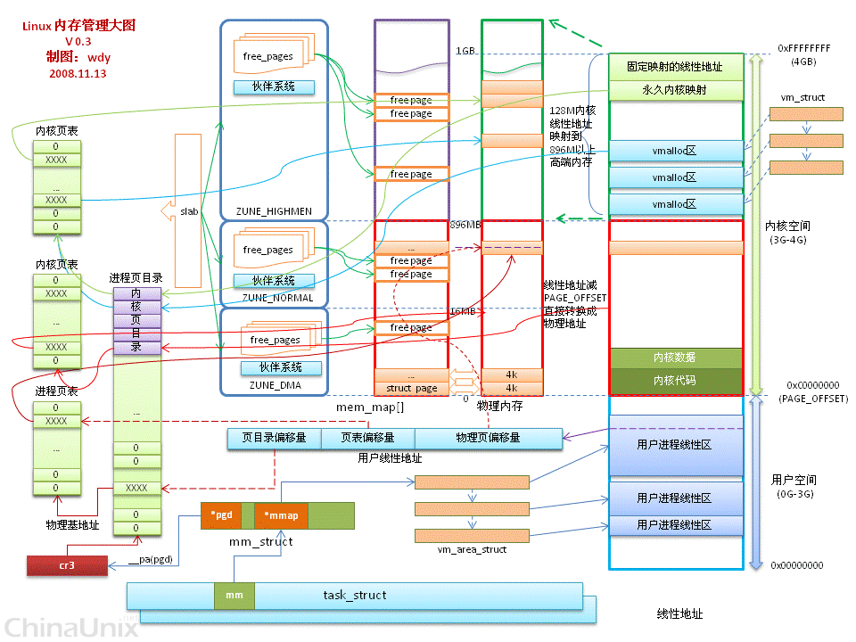
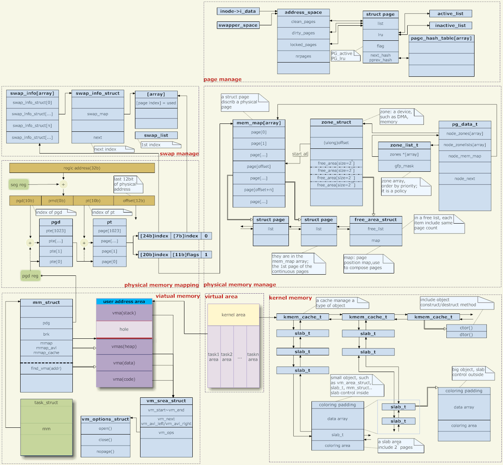
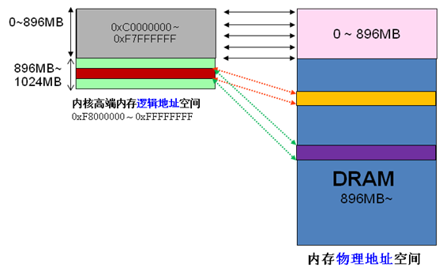
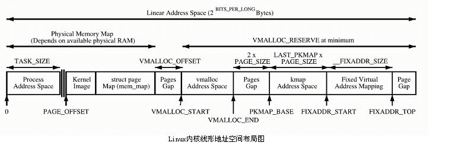

这里引用计算机界一句无从考证的名言：“计算机系统里的任何问题都可以靠引入一个中间层来解决。”

## 1. 虚拟地址、物理地址、逻辑地址、线性地址
虚拟地址又叫线性地址。linux没有采用分段机制，所以逻辑地址和虚拟地址（线性地址）（在用户态，内核态逻辑地址专指下文说的线性偏移前的地址）是一个概念。
物理地址自不必提。内核的虚拟地址和物理地址，大部分只差一个线性偏移量。用户空间的虚拟地址和物理地址则采用了多级页表进行映射，但仍称之为线性地址。

## 2. DMA/HIGH_MEM/NROMAL 分区

在x86结构中，Linux内核虚拟地址空间划分0~3G为用户空间，3~4G为内核空间(注意，内核可以使用的线性地址只有1G)。内核虚拟空间（3G~4G）又划分为三种类型的区：

ZONE_DMA 3G之后起始的16MB

ZONE_NORMAL 16MB~896MB

ZONE_HIGHMEM 896MB ~1G

由于内核的虚拟和物理地址只差一个偏移量：物理地址 = 逻辑地址 – 0xC0000000。所以如果1G内核空间完全用来线性映射，显然物理内存也只能访问到1G区间，这显然是不合理的。HIGHMEM就是为了解决这个问题，专门开辟的一块不必线性映射，可以灵活定制映射，以便访问1G以上物理内存的区域。从网上扣来一图，

高端内存的划分，又如下图，

内核直接映射空间 PAGE_OFFSET~VMALLOC_START，kmalloc和__get_free_page()分配的是这里的页面。二者是借助slab分配器，直接分配物理页再转换为逻辑地址（物理地址连续）。适合分配小段内存。此区域 包含了内核镜像、物理页框表mem_map等资源。

内核动态映射空间 VMALLOC_START~VMALLOC_END，被vmalloc用到，可表示的空间大。

内核永久映射空间 PKMAP_BASE ~ FIXADDR_START，kmap

内核临时映射空间 FIXADDR_START~FIXADDR_TOP，kmap_atomic

## 3. 参考

- [Linux内存管理原理](https://www.cnblogs.com/zhaoyl/p/3695517.html)