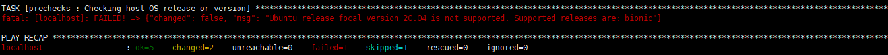

https://releases.openstack.org/teams/kolla.html

| OpenStack Release  | Kolla version |  Kolla-ansible | Kolla-cli|
| ----------- | ----------- |-----------|-----------|
|   Victoria    | 11.0.0       |11.0.0  |           | 
| Ussuri   | 10.2.0  10.1.0  10.0.0    | 10.2.0  10.1.0  10.0.0 | 10.0.0|

4.Host OS Support Ansible

| ubuntu版本  | kolla-ansible 版本 |  openstack 版本| libvirt/qemu | ansible|
| ----------- | ----------- |----------- | ----------- | ----------- |
|   20.04 Focal/18.04 Bionic  | 11.0.0  |victoria  |  6.0.0/4.2  | 2.9.19 |
| 18.04 Bionic   | 10.2.0 | ussuri | 6.0.0/4.2 | 2.9.19| 

u版openstack只支持ubuntu18.04， v版openstack支持ubuntu18.04和20.04, 详见：

代码：https://github.com/openstack/kolla-ansible/blob/stable/ussuri/ansible/roles/prechecks/vars/main.yml

代码提交记录：https://review.opendev.org/c/openstack/kolla-ansible/+/699443

u版在ubuntu 20.04上执行prechecks脚本时，报如下错误：


如果忽略此错误，deploy脚本能执行成功，并且openstack基础功能测试通过。但是不确定有没有其余未知问题。

**因此建议**，在ubuntu18.04 bionic版本上部署u版openstack。

5. openstack 容器集

|        分类  |       服务        | 
|-------------|-------------------|
| database control  | galera/mariadb/mongodb |
| messaging control | rabbitmq |
|high availability control |HAProxy/keepalived |
|OpenStack interface | keystone/glance-api/nova-api/ceilometer-api/heat-api |
| OpenStack control | glance-controller(glance-registry)/nova-controller(nova-conductor/nova-scheduler/metadata-service)/cinder-controller/ neutron-controller(neutron-server)/ceilometer-controller(ceilometer-alarm/ceilometer-base/ceilometer-central/ ceilometer-collector/ceilometer-notification)/heat-controller(heat-engine) |
| OpenStack compute operation | nova-compute/nova-libvirt/neutron-agents-linux-bridge/neutron-agents-ovs |
| OpenStack network operation | dhcp-agent/l3-agent/metadata-agent/lbaas-agent/fwaas-agent |
| OpenStack storage operation | Cinder/Swift(swift-account/swift-base/swift-container/swift-object/swift-proxy-server) |
| cache service	| redis/memcached |


二、kolla部署openstack

1. 准备操作系统基础环境

包括： 安装系统基础环境依赖包、 惯例开启 NTP 时间同步服务、 惯例关闭防火墙服务、 惯例禁用宿主机的 Libvirt 服务：
大多数操作系统会默认启动 Libvirt，但使用 Kolla 来部署 OpenStack 的话，Libvirt 应该在容器中运行并管理虚拟机，为了避免冲突与执行报错，所以宿主机的 Libvirt 需要被关闭或者卸载libvirt相关安装包
```
apt remove -y `apt list --installed | grep libvirt | awk '{print $1}'`
dpkg -P `dpkg -l | grep libvirt | awk '{print $2}'`
```
2.准备 Python 基础环境

安装python、ansible以及配置文件

3.准备 Docker 基础环境

安装docker

4.安装 kolla & kolla-ansible

5.Kolla Build Images

建议使用 Kolla 在本地构建镜像，并且搭建 Local Registry。

6.Deploy All-in-One OpenStack

可以把 Kolla-ansible 看作是 Kolla 对 Ansible 的封装，实现了大量的 Play 和自定义模块。

Kolla-ansible 同样通过提供一个完整的 Playbook 来实现脚本自动化，在源码目录 inventory 下还提供了 all-in-one 和 multihost 两种主机清单。单点部署的话，一般不需要多做修改，直接使用 all-in-one 清单是个不错的选择。但如果你希望进行多节点部署，可以通过修改 multihost 清单中的主机分组来达到定制化分布式部署架构的目的。

NOTE：进行多节点部署，还需要部署 Local Docker Register 服务器，搭建 Docker 私有仓库，详细请浏览：
https://docs.openstack.org/kolla-ansible/latest/user/multinode.html

**Tips：** 多节点部署时，需要保证管理节点和各主机之间能够使用 SSH 免密登陆。

Step 1. 自动生成随机密码来填充 passwords.yml 项目

```kolla-genpwd```

Step 2. 处理 bootstrap servers 所需要的依赖

```kolla-ansible -i ~/all-in-one bootstrap-servers```

Step 3. 部署环境预检查

```kolla-ansible -i ~/all-in-one prechecks```

**Tips：** 做 `prechecks` 前需要完成 `kolla-genpwd`

Step 4. 正式开始 Deploy：

```
kolla-ansible -i ~/all-in-one pull// 拉镜像，建议先拉完全部镜像再部署
kolla-ansible -i ~/all-in-one deploy
```
选项 -i 指定主机清单，这和 Ansible 的用法是一致的。
成功 Deploy 之后，查看 Containers 状态：

**Tips：** Horizon 通常是最后部署的一个。

Step 5. 检验 & 使用

生成 admin-openrc.sh 文件：用于导入 Keystone Auth 环境变量
```
kolla-ansible post-deploy
ll /etc/kolla/admin-openrc.sh
```
执行`init-runonce`脚本，
初始化运行环境：会自动执行下列操作
```
Creating glance image.
Configuring neutron.
Generating ssh key.
Configuring nova public key and quotas.
```
**NOTE：** 如果你希望 External Network 正常运行，还需要编辑 init-runonce 初始化脚本中的网络配置，设定为 eth1 的网络元素。

```source /etc/kolla/admin-openrc.sh
./init-runonce
```
启动实例，验证环境：
```
openstack server create \
--image cirros \
--flavor m1.tiny \
--key-name mykey \
--network demo-net \
demo1
```

Step 6. 销毁/重新配置

**NOTE：** 如果你希望彻底清理完部署好的环境，只需执行下列指令。
```
kolla-ansible destroy -i all-in-one --yes-i-really-really-mean-it
//重新配置容器组件
kolla-ansible -i all-in-one reconfigure -t nova
//清理kolla ansible集群
kolla-ansible destroy --include-images --yes-i-really-really-mean-it
//停止部署节点容器
kolla-ansible stop
#或者
[root@kolla ~]# cd /usr/share/kolla-ansible/tools/
[root@all tools]# ./cleanup-containers
[root@all tools]# ./cleanup-host
```
**Note:** 
修改docker容器里的配置文件 直接修改`/etc/ansible/nova`下面的配置，然后重启容器即可。

查看容器信息和log
```
docker inspect <container>
docker logs -f <container>
```