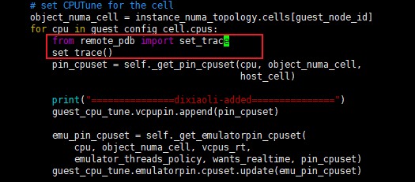
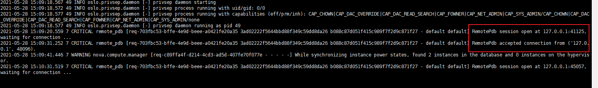
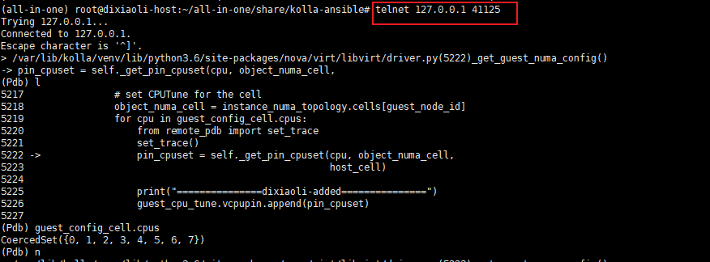

# Debug Nova Code in Docker

本文介绍怎样在docker容器中debug nova代码

## 1. 开启kolla_dev_mode
部署kolla-ansible时，在`/etc/kolla/globals.yml`中开启 `kolla_dev_mode: "yes"`
```
（1）kolla_dev_mode 为yes时，所有openstack组件都会下载源码并挂载；若只调nova，可以修改kolla-ansible/ansible/roles/nova/default/all.yml 中 nova_dev_node: "yes"
（2）若git clone https://opendev/openstack/nova 比较慢，可以选择自行上传脚本，并注释到部署代码中clone.yml
```
## 2.nova代码挂载
部署nova的时候，会将nova的源码下载在`/opt/stack`,并将源码挂载到nova 容器中，如下：
```
{
"Type": "bind",
"Source": "/opt/stack/nova/nova",
"Destination": "/var/lib/kolla/venv/lib/python3.6/site-packages/nova",
"Mode": "rw",
"RW": true,
"Propagation": "rprivate"
},
```
## 3.修改源码
修改`/opt/stack`下nova源码，`docker restart nova_compute`即可生效。

## 4.pdb调试
(1) 首先需要在容器中安装remote_pdb
```
docker exec -it -u root nova_compute pip install remote_pdb
```
(2) 在程序中加断点：



(3) 重启容器 docker restart nova_compute

(4) 查看容器日志
tail -100f /var/log/kolla/nova/nova-compute.log



(5) telnet到日志中输出的地址，执行调试命令



(6) 除了telnet，也可以用socat 连接pdb socat readline tcp:127.0.0.1:41125
