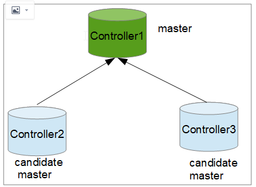
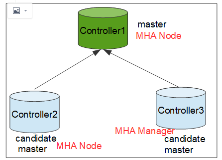
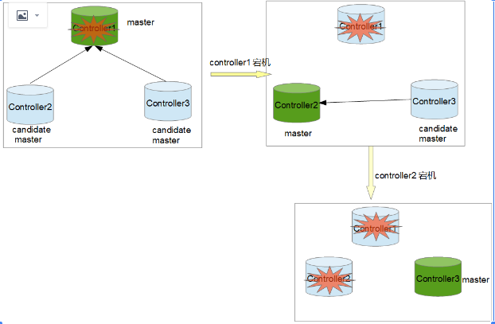

2021/3/23

本文介绍三节点主备+mha部署配置。
```
一、mysql部署架构
二、 配置基于GTID主从复制、半同步复制、并行复制
三、安装MHA
四、配置MHA
五、MHA测试
六、主备mysql安全开关机步骤
```

## MHA+MySQL主备配置以及failover

## 一、mysql部署架构
一主两备，如下图所示：



## 二、 配置基于GTID主从复制、半同步复制、并行复制

mariadb10以后自带galera软件，10以前必须要额外安装galera。

首先，关闭现有galera cluster，VIP在controller1上：
先关闭controller2和controller3的服务，再关闭controller1.

1. 主库设置：

（1）修改配置文件
```
# cat server.cnf
[mysqld]
server_id=1
log-bin=mysql-bin # 开启二进制日志
max_connections=3000
innodb_log_file_size=480M
log_error=/var/log/mariadb/mariadb.log
log_output=FILE
binlog_format=row # 其他格式可能造成数据不一致
default_storage_engine=InnoDB
 
innodb_autoinc_lock_mode=2
innodb_flush_log_at_trx_commit=0
 
rpl_semi_sync_master_enabled=ON
rpl_semi_sync_master_timeout=5000
rpl_semi_sync_slave_enabled=1
 
slave-parallel-workers=4
master_info_repository=TABLE
 
skip_slave_start=1
```
启动mariadb，如果报错，请查看日志：/var/log/mariadb/mariadb.log

（2）创建用户，赋予主从同步权限
```
MariaDB [(none)]> create user repl identified by 'repl';
MariaDB [(none)]> grant all privileges on *.* to 'repl'@'%' identified by 'repl' with grant option;
MariaDB [(none)]> grant replication slave on *.* to 'repl'@'%';
MariaDB [(none)]> flush privileges;
```
（3）重启mariadb服务

2. 备库设置(多节点)

（1）修改配置文件，同controller1，只是server_id不同,增加read_only=1

重启mariadb服务

3. 建立主从关系

备
```
MariaDB [(none)]>change master to master_host='172.27.131.51', master_user='repl', master_password='repl',  master_use_gtid=current_pos;
MariaDB [(none)]> start slave;
MariaDB [(none)]> show slave status \G;

报错，可以在master上执行
reset master //该操作会清除master的binlog，慎用
met error
Last_IO_Error: Got fatal error 1236 from master when reading data from binary log: 'Error: connecting slave requested to start from GTID 0-1-395, which is not in the master's binlog'
```
4.验证
在controller1上创建db，查看备节点，已经同步；
"real_only"只会禁止普通用户权限的mysql写操作，不能限制super权限用户的写操作；
如果要想连super权限用户的写操作也禁止，就使用"flush tables with read lock;"，这样设置也会阻止主从同步复制！

5.查看半同步复制配置
（1). 主
```
MariaDB [(none)]> SHOW GLOBAL VARIABLES LIKE '%semi%';
+---------------------------------------+--------------+
| Variable_name                         | Value        |
+---------------------------------------+--------------+
| rpl_semi_sync_master_enabled          | ON           |
| rpl_semi_sync_master_timeout          | 5000         |
| rpl_semi_sync_master_trace_level      | 32           |
| rpl_semi_sync_master_wait_no_slave    | ON           |
| rpl_semi_sync_master_wait_point       | AFTER_COMMIT |
| rpl_semi_sync_slave_delay_master      | OFF          |
| rpl_semi_sync_slave_enabled           | ON           |
| rpl_semi_sync_slave_kill_conn_timeout | 5            |
| rpl_semi_sync_slave_trace_level       | 32           |
+---------------------------------------+--------------+
9 rows in set (0.006 sec)
 
 
MariaDB [(none)]> SHOW GLOBAL STATUS LIKE 'rpl_semi%';
+--------------------------------------------+-------+
| Variable_name                              | Value |
+--------------------------------------------+-------+
| Rpl_semi_sync_master_clients               | 0     |
| Rpl_semi_sync_master_get_ack               | 0     |
| Rpl_semi_sync_master_net_avg_wait_time     | 0     |
| Rpl_semi_sync_master_net_wait_time         | 0     |
| Rpl_semi_sync_master_net_waits             | 0     |
| Rpl_semi_sync_master_no_times              | 0     |
| Rpl_semi_sync_master_no_tx                 | 0     |
| Rpl_semi_sync_master_request_ack           | 0     |
| Rpl_semi_sync_master_status                | ON    |
| Rpl_semi_sync_master_timefunc_failures     | 0     |
| Rpl_semi_sync_master_tx_avg_wait_time      | 0     |
| Rpl_semi_sync_master_tx_wait_time          | 0     |
| Rpl_semi_sync_master_tx_waits              | 0     |
| Rpl_semi_sync_master_wait_pos_backtraverse | 0     |
| Rpl_semi_sync_master_wait_sessions         | 0     |
| Rpl_semi_sync_master_yes_tx                | 0     |
| Rpl_semi_sync_slave_send_ack               | 126   |
| Rpl_semi_sync_slave_status                 | ON    |
+--------------------------------------------+-------+
18 rows in set (0.003 sec)
```
## 三、安装MHA

参考：http://https://www.jianshu.com/p/be335429ce47



MHA git

https://github.com/yoshinorim/mha4mysql-manager

https://github.com/yoshinorim/mha4mysql-node

controller1~3安装MHA Node，controller3作为从节点安装MHA Manager. mha manager 依赖mha node

修改yum源并更新：
```
sudo wget -O CentOS-Base.repo http://mirrors.aliyun.com/repo/Centos-7.repo
yum install epel-release -y
yum clean all;yum makecache
```
安装perl基础包：

yum install perl-DBD-MySQL perl-ExtUtils-MakeMaker -y

controller1~3安装mha node:
`# yum install -y mha4mysql-node-0.58-0.el6.noarch.rpm`

在controller3上安装mha manager:
`# yum install -y mha4mysql-manager-0.58-0.el6.noarch.rpm`

创建MHA的工作目录，并且创建相关配置文件
```
mkdir /etc/masterha
mkdir /var/log/masterha
mkdir scripts
```
在manager上配置conf文件,并创建相关目录和拷贝相关脚本；
```
[root@controller3 masterha]# cat app1.conf
[server default]
manager_workdir=/etc/masterha           #设置manager的工作目录
manager_log=/var/log/masterha.log       #设置manager的日志
master_ip_failover_script=/etc/masterha/scripts/master_ip_failover.sh    #设置自动failover时候的切换脚本
master_ip_online_change_script=/usr/local/bin/master_ip_online_change.sh    #设置手动切换时候的切换脚本
ping_interval=1              #设置监控主库，发送ping包的时间间隔，默认是3秒，尝试三次没有回应的时候自动进行failover
password=mha
remote_workdir=/var/log/mysql #设置远端mysql在发生切换时binlog的保存位置
ssh_user=root
user=mha
#report_script=/usr/local/send_report   #设置发生切换后发送的报警的脚本
#secondary_check_script=/usr/local/bin/masterha_secondary_check -s server03 -s server02 
#shutdown_script=""        #设置故障发生后关闭故障主机脚本（该脚本的主要作用是关闭主机防止发生脑裂,这里没有使用）
 
[server1]
candidate_master=1 #设置为候选master，如果设置该参数以后，发生主从切换以后将会将此从库提升为主库，即使这个主库不是集群中事件最新的slave
check_repl_delay=0 #默认情况下如果一个slave落后master 100M的relay logs的话，MHA将不会选择该slave作为一个新的master，
 # 因为对于这个slave的恢复需要花费很长时间，通过设置check_repl_delay=0,MHA触发切换在选择一个新的master的时候将会忽略复制延时，
 # 这个参数对于设置了candidate_master=1的主机非常有用，因为这个候选主在切换的过程中一定是新的master
 
hostname=controller1
port=3306
 
[server2]
candidate_master=1
check_repl_delay=0
hostname=controller2
port=3306
 
[server3]
candidate_master=1
check_repl_delay=0
hostname=controller3
port=3306
#no_master=1  #其中上面的candidate_master=1和check_repl_delay=0与no_master=1的意思相反,所以只需设置一个。(此参数的意思是:不会称为备选的master)
```
## 四、配置MHA

主节点创建mha用于控制主从切换的用户:并在两个从节点上执行赋予权限命令
```
MariaDB [(none)]> create user 'mha'@'%' identified by 'mha';
Query OK, 0 rows affected (0.014 sec)
 
MariaDB [(none)]> grant all privileges on *.* to 'mha'@'%' identified by 'mha';
Query OK, 0 rows affected (0.001 sec)
 
MariaDB [(none)]> flush privileges;
Query OK, 0 rows affected (0.002 sec)
所有主机上授权：
mysql> grant replication slave on *.*  to repl identified by 'repl';
mysql> flush privileges;
mysql>grant all on *.* to root identified by 'Troila12#$'; #很重要
```

设置定期清除relay_logscrontab

mysql默认会自动清理relay_logs，但MHA会使用relay_logs在主从切换时恢复数据，所以MHA会关闭relay_logs的自动清理功能，会导致relay_logs逐渐增多。
```
*/30 * * * * purge_relay_logs --user=faxuan --password=faxuan.net --host=192.168.1.172--port=3307 --disable_relay_log_purge >> /var/log/relay_log_purge.txt2>&1
```

## 五、MHA测试

执行ssh校验脚本；

```
# masterha_check_ssh --conf=/etc/masterha/app1.conf
```
执行repl校验脚本
```
# masterha_check_repl --conf=/etc/masterha/app1.conf
```
报错1：
```
Tue Mar 16 13:29:36 2021 - [info] binlog_do_db= , binlog_ignore_db= Tue Mar 16 13:29:36 2021 - [info] Replication filtering check ok. Tue Mar 16 13:29:36 2021 - [error][/usr/share/perl5/vendor_perl/MHA/MasterMonitor.pm, ln424] Error happened on checking configurations. Argument "1 # M-gM-:M-/M-dM-;M-^NM-eM-:M-^S" isn't numeric in numeric ge (>=) at /usr/share/perl5/vendor_perl/MHA/ServerManager.pm line 1157. Tue Mar 16 13:29:36 2021 - [error][/usr/share/perl5/vendor_perl/MHA/MasterMonitor.pm, ln523] Error happened on monitoring servers. Tue Mar 16 13:29:36 2021 - [info] Got exit code 1 (Not master dead). 原因是conf文件中增加了中文注释
```
报错2:
```
Last_SQL_Error: Could not execute Delete_rows_v1 event on table microservice.vm_monitor_data; Can't find record in 'vm_monitor_data', Error_code: 1032; handler error HA_ERR_KEY_NOT_FOUND; the event's master log mysql-bin.000002, end_log_pos 258335
```
报错3:
```
connecting slave requested to start from GTID 0-2-5552, which is not in the master's binlog'
```
fix:

先切回用pos的同步：
```
change master to master_host='172.27.131.51', master_user='repl', master_password='repl',master_log_file='mysql-bin.000002', master_log_pos=842526; set global sql_slave_skip_counter=1; stop slave; start slave; 然后再切回GTID；
```
启动MHA参数介绍：

|参数名称 |  参数介绍| 备注 |
|--------|---------|-----|
|remove_dead_master_conf| | | 
ignore_last_failover | | |
```
# nohup masterha_manager -conf=/etc/masterha/app1.conf &> /var/log/masterha/manager.log & [1] 2269516 nohup masterha_manager --conf=/etc/masterha/app1.cnf --remove_dead_master_conf --ignore_last_failover < /dev/null > /var/log/masterha/app1/manager.log 2>&1 & nohup masterha_manager --conf=/etc/masterha/app1/app1.cnf   --remove_dead_master_conf --ignore_last_failover < /dev/null >  /var/log/mha/app1/manager.log  2>&1 &
```
查看master manager状态
```
# masterha_check_status -conf=/etc/masterha/app1.conf app1 (pid:2269516) is running(0:PING_OK), master:controller1 You have new mail in /var/spool/mail/root
```
停止MHA`masterha_stop -conf=/etc/masterha/app1.conf`

测试MHA 故障转移 停掉controller1的mysql
```
Slave_SQL_Running_State: Slave has read all relay log; waiting for the slave I/O thread to update it
error connecting to master 'repl@172.27.131.52:3306' - retry-time: 60  maximum-retries: 86400  message: Access denied for user 'repl'@'controller3' (using password: YES)
fix：在controllre2上执行：
grant all privileges on *.* to 'repl'@'%' identified by 'repl';
flush privileges;
```
备主升级成新主，mha进程退出；

正常自动切换一次后，MHA 进程会退出。HMA 会自动修改 app1.cnf 文件内容，将宕机的 mysql1 节点删除。

恢复controller mysql服务：

报错：controller2有问题
`Last_IO_Error: error reconnecting to master 'repl@172.27.131.51:3306' - retry-time: 60 maximum-retries: 86400 message: Can't connect to MySQL server on '172.27.131.51' (111 "Connection refused") fix stop slave; start slave`

启动mha报错如下：
```
Tue Mar 16 14:35:13 2021 - [error][/usr/share/perl5/vendor_perl/MHA/ServerManager.pm, ln781] Multi-master configuration is detected, but two or more masters are either writable (read-only is not set) or dead! Check configurations for details. Master configurations are as below: Master controller1(172.27.131.51:3306) Master controller2(172.27.131.52:3306), replicating from 172.27.131.51(172.27.131.51:3306)
```
原因是出现了2个主。需要手动将controller3指向到controller1上即可。

问题：宕机的机器，以什么身份加入？

A: 宕机的机器，以备主的身份加入。

增加keepalived，再次测试failover
```
Server controller1(172.27.131.51:3306) is dead, but must be alive! Check server settings
```
MHA 手动failover(MHA Manager必须没有运行)
```
# masterha_master_switch --master_state=dead --conf=/etc/masterha/app1.cnf --dead_master_host=172.25.83.1 --dead_master_port=3306 --new_master_host=172.25.83.2 --new_master_port=3306 --ignore_last_failover --ignore_last_failover可加可不加，（因为每次手动failover完成之后，都会在/etc/masterha目录下生成app1.failover.complete文件），这个参数的含义是忽略该文件的存在（因为如果该文件存在，且不加该参数，再次failover时会报错。因此要么该文件存在，加此参数；要么就将该文件删除，再进行测试
```
自动failover(热切换)

## 六、主备mysql安全开关机步骤：

1.登录controller3，关闭mha
```
# masterha_check_status --conf /etc/masterha/app1.conf # masterha_stop -conf=/etc/masterha/app1.conf # masterha_check_status --conf /etc/masterha/app1.conf
```
2.关闭mysql从库
```
show slave status\G; Slave_IO_Running: Yes Slave_SQL_Running: Yes show status like '%slave%'; Slave_open_temp_tables | 0 stop slave; # mysqladmin shutdown -uroot -pTroila12#$ # ps -ef |grep mysql
```
3.关闭主库mysql
```
# mysqladmin shutdown -uroot -pTroila12#$ # ps -ef |grep mysql
```
4.开机过程按照上述顺序反着来即可。
总结如下：
```
关闭mha 
关闭mysql从库 
a.先查看当前的主从同步状态show slave status\G;看是否双yes 
使用SHOW STATUS检变量的值 如果值为0，
使用mysqladmin shutdown命令关闭从服务器 如果值不为0，用START SLAVE重启从服务器线程 slave_open_temp_tables值显示，
当前slave创建了多少临时表，注意由client显示创建的 即便是这样，在使用临时表的场景下，如果服务器宕机，将遇到不可预知的问题。 
所以比较保险的做法是，创建实体表，虽然会由于分配的文件刷新到磁盘。 
b.执行stop slave 　 
c.停止从库服务mysqladmin shutdown -u用户名 -p密码 　 
d.查看是否还有mysql的进程ps -ef | grep mysql 　 
e.如果部署了多个实例，那每个实例都要按照以上步骤来操作关闭MySQL主库 
停止主库服务mysqladmin shutdown -u用户名 -p密码 
查看是否还有mysql的进程ps -ef | grep mysql 
------------------------------------------ 
启动mysql主库 
启动MySQL从库 
a.启动从库服务mysqladmin start -u用户名 -p密码 　
b.启动复制start slave; 　
c.检查同步状态show slave status\G;是否双yes 　
d.查看mysql的进程ps -ef | grep mysql 
启动MHA
```
slave状态有问题：
```
show slave status\G; 
Slave_IO_Running: No 
Slave_SQL_Running: Yes 
Seconds_Behind_Master: NULL 
```
fix:
``` 
重启master库: systemctl restart mariadb 
show master status; 
登录slave，
执行： stop slave; 
change master to master_host='172.27.131.51', master_port=3306, master_user='repl', master_password='repl', master_log_file='controller1-bin.000002', master_log_pos=117189; 
start slave;
```
删除主从信息
```
mysql>change master to master_host=' '; 即可成功删除同步用户信息。
```
主从同步信息状态


主备切换引发的问题
起因：MHA切换演练时，将主节点断开，备节点承担主服务，业务测试正常；后将MHA恢复至原先状态，导致主键冲突，数据分散在主备数据库上，主从中断。



controller1宕机

controller2 升级为主，VIP 漂移成功；controllre3指向controller2；

手动启动mha

controller1恢复，手动加入备主，手动启动
```
set global read_only=1;
show global variables like "%read_only%";
```
往数据库里插入数据的过程中停库测试

有的时候不是因为主库挂了，而是因为主库那台服务器网络中断了，所以也要进行VIP漂移等测试，所以这里要强调一下，不管是任何操作，或正上线任何东西，大家一定都要把问题考虑全面。

利用zabbix等监控软件，监控mha的进程。

TODO:

1. MHA一次failover以后，进程就会退出，需要改成不退出；

2. 故障恢复，需要增加脚本，将修复好的加回来成为新备节点，并修改配置文件，重启mha。

3. mha单点故障问题，写监控脚本，最好增加监控服务，对mha服务状态进行监控；