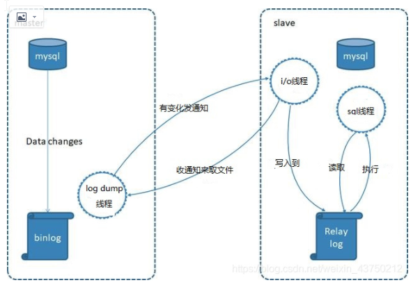
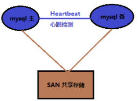
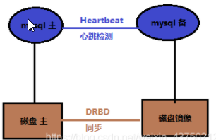
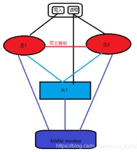
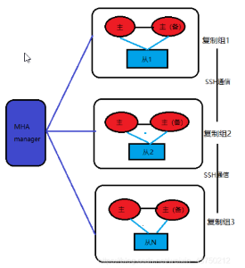

2021/3/18

本文主要讨论mysql高可用的基础原理以及常见的高可用架构。
```
一、MySQL 产品介绍
    1. mysql 产品列表
    2. mysql 版本列表
    3.mysql 存储引擎
    4. MySQL分支
    5.mysql 应用架构
        - 单点
        - 主从复制
        - 集群
二、原理
    1.主从复制原理
        binlog记录格式
    2. 基于GTID的主从复制
        GTID工作原理
    3.半同步复制
        半同步复制的原理
    4.并行复制
三、MySQL高可用集群方案
    方案一：共享存储,依托硬件配合
        heartbeat+SAN
    方案二：操作系统实时数据块复制
        heartbeat+DRDB
    方案三：主从复制架构
        1.主从复制
        2.主节点存在单点故障，如何排除？
            MySQL Fabirc
            MMM架构(双主多从)
            MHA架构(多主多从)
    方案四：集群高可用架构
        1. MGR(MySQL Group Replication)
        2. Mysql cluster
        3. Galera Cluster
        4. PXC(Percona XtraDB Cluster)
        5. Zookeeper + proxy
    方案五、读写分离解决方案
```
## 一、MySQL 产品介绍
MySQL数据库是一款深受欢迎的开源领域的重要的关系型数据库产品，由瑞典MySQL AB公司开发与维护，
2006年，Mysql AB公司被SUN公司收购，并做了很多改进2008年，SUN公司又被数据库龙头公司甲骨文（oracle公司）收购，
因此，Mysql数据库目前属于oracle公司，成为传统数据库领域老大的又一个数据库产品，甲骨文公司收购MySQL后，
使得自身在商业数据库与开源数据库领域市场占有份额都跃居第一的位置，这样的格局，引起了业内的人士担忧，
这种担忧直接导致后来的MySQL分支数据库Mariadb的诞生与发展，除此之外还有其他的一些分支。

### 1. mysql 产品列表
登录mysql官网，可以看到mysql的产品列表主要分为以下三类

| 社区免费 | 1.MySQL community server 2.Mysql Cluster  3.Mysql Router 4. Mysql shell|
|---------|-----------|
|    商业收费版    |  包含以下组件： 1.MySQL Database 2.MySQL Enterprise Backup 3.MySQL Enterprise Monitor 4.MySQL Workbench Standard Edition |
|    集群版 |  1.Mysql Cluster CGE 2.Mysql NDB Cluster 3. Mysql InnoDB Cluster |

### 2. mysql 版本列表
版本说明：
- Alpha  暗示这是一个以展示新特性为目的的版本，存在比较多的不稳定因素，还会向代码中添加新新特性
- BETA 以后的beta版、发布版或产品发布中，所有API、外部可视结构和SQL命令列均不再更改,不再向代码中添加影响代码稳定性的新特性。
- RC是指 Release Candidate. Release candidates被认为是稳定的, 通过了mysql所有的内部测试, 修正了所有已知的致命bug. 但是rc版本还没有经历足够长的时间来确认所有bug都已经发现，但是对rc版本只会做些小的bug修正
- GA如果没有后缀,则暗示这是一个大多数情况下可用版本或者是产品版本。. GA releases是稳定的, 并通过了早期版本的测试，并显示其可用性， 解决了所有严重的bug, 并且适合在生产环境中使用. 只有少数较为严重的bug修改才会添加到该版本中。

|版本 | 3.X～5.1.X | 5.4.X到5.7.X | 6.0.X到7.1.X|
|-----|-----------|--------------|------------|
|说明 | 这是早期MySQL的版本。常见早期的版本有：4.1.7、5.0.56等。|这是为了整合MySQL AB公司社区和第三方公司开发的新存储引擎。吸收新的实现算法，更好的支持SMP架构。为提升性能做了大量代码重构。现在是主流使用的版本。常见使用版本：5.5,5.6,5.7 |这是为了更好推广MySQL Cluster版本，以及提高MySQL性能和稳定性以及新功能。改动MySQL基础功能，从而对Cluster存储引擎提供更有效支持优化。因为发布时间较晚，发布时已经有其他手段解决MySQL集群技术问题，所以并没有很好的推广使用 |


### 3.mysql 存储引擎
在数据库中存的就是一张张有着千丝万缕关系的表，所以表设计的好坏，将直接影响着整个数据库。而在设计表的时候，我们都会关注一个问题，使用什么存储引擎。

**什么是存储引擎？**

MySQL中的数据用各种不同的技术存储在文件(或者内存)中。这些技术中的每一种技术都使用不同的存储机制、索引技巧、锁定水平并且最终提供广泛的不同的功能和能力。通过选择不同的技术，你能够获得额外的速度或者功能，从而改善你的应用的整体功能。 例如，如果你在研究大量的临时数据，你也许需要使用内存MySQL存储引擎。内存存储引擎能够在内存中存储所有的表格数据。又或者，你也许需要一个支持事务处理的数据库(以确保事务处理不成功时数据的回退能力)。
这些不同的技术以及配套的相关功能在 MySQL中被称作存储引擎(也称作表类型)。 MySQL默认配置了许多不同的存储引擎，可以预先设置或者在MySQL服务器中启用。你可以选择适用于服务器、数据库和表格的存储引擎，以便在选择如何存储你的信息、如何检索这些信息以及你需要你的数据结合什么性能和功能的时候为你提供最大的灵活性。

在mysql客户端中，使用`show engines;`命令查看MySQL支持的引擎。

| 存储引擎 | 介绍 |
|---------|-----|
| MyISAM | 它不支持事务，也不支持外键，尤其是访问速度快，对事务完整性没有要求或者以SELECT、INSERT为主的应用基本都可以使用这个引擎来创建表。|
| InnoDB | InnoDB是一个健壮的事务型存储引擎，这种存储引擎已经被很多互联网公司使用，为用户操作非常大的数据存储提供了一个强大的解决方案。 |
| BDB | |
|MEMORY | 使用MySQL Memory存储引擎的出发点是速度。为得到最快的响应时间，采用的逻辑存储介质是系统内存。虽然在内存中存储表数据确实会提供很高的性能，但当mysqld守护进程崩溃时，所有的Memory数据都会丢失。获得速度的同时也带来了一些缺陷。它要求存储在Memory数据表里的数据使用的是长度不变的格式，这意味着不能使用BLOB和TEXT这样的长度可变的数据类型，VARCHAR是一种长度可变的类型，但因为它在MySQL内部当做长度固定不变的CHAR类型，所以可以使用。|
| MERGE | MERGE存储引擎是一组MyISAM表的组合，这些MyISAM表结构必须完全相同，尽管其使用不如其它引擎突出，但是在某些情况下非常有用。说白了，Merge表就是几个相同MyISAM表的聚合器；Merge表中并没有数据，对Merge类型的表可以进行查询、更新、删除操作，这些操作实际上是对内部的MyISAM表进行操作。|
| ARCHIVE | Archive是归档的意思，在归档之后很多的高级功能就不再支持了，仅仅支持最基本的插入和查询两种功能|
|Federated | |
|maria | | 
| Cluster/NDB | | 
| csv | |
| BlackHole || 
|example ||

### 4. MySQL分支

|分支名称 | 公司名称 |  说明| 
|-------|----------|-----|
|MariaDB|MariaDB|Mariadb是由MySQL创始人Monty创建的，是一款高度兼容的MySQL产品，主要由开源社区维护，采用GPL授权许可。Oracle把MySQL收购之后，为避免MySQL在开源粒度上的下降，MariaDB由此而生。它不仅仅是MySQL的一个替代品，还创新与提高了MySQL原有的技术。既包含了Percona的XtraDB存储引擎，还包含TokuDB存储引擎、Spider水平分片存储引擎等多种存储引擎，并且还有一些复制功能上的新特性，比如基于表的并行复制、Multi-source Replication多源复制、Galera Cluster集群。还有比较有意思的一点就是MariaDB有一套Java的管理系统，可以通过投票机制来决定哪些特性和参数是我们需要的。|
|Percona  XtraDB|Percona|Percona Server是MySQL重要的分支之一，它基于InnoDB存储引擎的基础上，提升了性能和易管理性，最后形成了增强版的XtraDB引擎，可以用来更好地发挥服务器硬件上的性能。所以Percona Server也可以称为增强的MySQL与开源的插件（plugin）的结合.|
|Drizzle| ||

**mariadb 和mysql 的版本对应关系**

| mariadb | mysql |
|---------|-------|
|5.1, 5.2,5.3 | 5.1|
|5.5 | 5.5|
|10.2, 10.3, 10.4 | 5.7|

### 5.mysql 应用架构
- 单点
- 主从复制
- 集群

主从和集群的区别：

|架构|优点|缺点|
|---|---|----|
|主从|主从之间是通过mysql的replication来保证数据的一致性；主节点要开启binlog。相对mysql集群的数据同步方式来讲是异步的。|不满足高可用，master宕机，需要手动切换才行；数据存在不一致可能|
|集群|数据节点之间采用的是同步复制来保证各节点之间数据实时同步 |高可用写性能降低|

## 二、原理
### 1.主从复制原理
MySQL之间数据复制的基础是二进制日志文件（binary log file）。一台MySQL数据库一旦启用二进制日志后，其作为master，它的数据库中所有操作都会以“事件”的方式记录在二进制日志中，其他数据库作为slave通过一个I/O线程与主服务器保持通信，并监控master的二进制日志文件的变化，如果发现master二进制日志文件发生变化，则会把变化复制到自己的中继日志中，然后slave的一个SQL线程会把相关的“事件”执行到自己的数据库中，以此实现从数据库和主数据库的一致性，也就实现了主从复制。

 

其通过三个线程来完成，在master节点上运行的binlogdump线程以及在slave节点上运行的I/O线程和SQL线程。

1.master节点上的binlogdump线程，在slave与其正常连接的情况下，将binlog发送到slave上。

2.slave节点上的I/O线程，通过读取master节点发送的内容，并将数据复制到本地的relaylog中。

3.slave节点上的SQL线程，读取relaylog中的日志，并解析成具体操作，来实现主从的操作一致，而最终数据一致；

**binlog记录格式**

MySQL 主从复制有三种方式：

- 基于SQL语句的复制（statement-based replication，SBR），
- 基于行的复制（row-based replication，RBR)，
- 混合模式复制（mixed-based replication,MBR)。
  
对应的binlog文件的格式也有三种：STATEMENT,ROW,MIXED。

- Statement-base Replication (SBR)就是记录sql语句在bin log中，Mysql 5.1.4 及之前的版本都是使用的这种复制格式。优点是只需要记录会修改数据的sql语句到binlog中，减少了binlog日质量，节约I/O，提高性能。缺点是在某些情况下，会导致主从节点中数据不一致（比如sleep(),now()等）。
主库binlog格式为Statement，同步到从库执行后可能造成主从不一致。
- Row-based Relication(RBR)是mysql master将SQL语句分解为基于Row更改的语句并记录在bin log中，也就是只记录哪条数据被修改了，修改成什么样。优点是不会出现某些特定情况下的存储过程、或者函数、或者trigger的调用或者触发无法被正确复制的问题。缺点是会产生大量的日志，尤其是修改table的时候会让日志暴增,同时增加bin log同步时间。也不能通过bin log解析获取执行过的sql语句，只能看到发生的data变更。
- Mixed-format Replication(MBR)，MySQL NDB cluster 7.3 和7.4 使用的MBR。是以上两种模式的混合，对于一般的复制使用STATEMENT模式保存到binlog，对于STATEMENT模式无法复制的操作则使用ROW模式来保存，MySQL会根据执行的SQL语句选择日志保存方式。

### 2. 基于GTID的主从复制
传统的基于binlog position复制的方式有个严重的缺点：如果slave连接master时指定的binlog文件错误或者position错误，会造成遗漏或者重复，很多时候前后数据是有依赖性的，这样就会出错而导致数据不一致。
从MYSQL5.6开始，mysql开始支GTID复制。GTID的全称是global transaction id，表示的是全局事务ID。GTID的分配方式为uuid:trans_id.
GTID是一个基于原始mysql服务器生成的一个已经被成功执行的全局事务ID，它由服务器ID以及事务ID组合而成。这个全局事务ID不仅仅在原始服务器器上唯一，在所有存在主从关系 的mysql服务器上也是唯一的。正是因为这样一个特性使得mysql的主从复制变得更加简单，以及数据库一致性更可靠。
GTID = source_id:transaction_id
source_id，用于鉴别原服务器，即mysql服务器唯一的的server_uuid，由于GTID会传递到slave，所以也可以理解为源ID。
transaction_id，为当前服务器上已提交事务的一个序列号，通常从1开始自增长的序列，一个数值对应一个事务。

示例：
3E11FA47-71CA-11E1-9E33-C80AA9429562:23
前面的一串为服务器的server_uuid，即3E11FA47-71CA-11E1-9E33-C80AA9429562，后面的23为transaction_id

**GTID工作原理**

master更新数据时，会在事务前产生GTID，一同记录到binlog日志中。slave端的i/o 线程将变更的binlog，写入到本地的relay log中。sql线程从relay log中获取GTID，然后对比slave端的binlog是否有记录。如果有记录，说明该GTID的事务已经执行，slave会忽略。如果没有记录，slave就会从relay log中执行该GTID的事务，并记录到binlog。在解析过程中会判断是否有主键，如果没有就用二级索引，如果没有就用全部扫描。

**GTID 优点：**
```
1. 保证同一个事务在某slave上绝对只执行一次，没有执行过的gtid事务总是会被执行。
2. 不用像传统复制那样保证binlog的坐标准确，因为根本不需要binlog以及坐标。
3. 故障转移到新的master的时候很方便，简化了很多任务。
4. 很容易判断master和slave的数据是否一致。只要master上提交的事务在slave上也提交了，那么一定是一致的.
5. 更简单的实现failover，不用以前那样在需要找log_file和log_pos。
6. 更简单的搭建主从复制。
7. 比传统的复制更加安全
8. GTID是连续的没有空洞的，保证数据的一致性，零丢失。
9. 减少手工干预和降低服务故障时间，当主机挂了之后通过软件从众多的备机中提升一台备机为主机。
```
当然，MySQL提供了选项 可以控制跳过某些gtid事务，防止slave第一次启动复制时执行master上的所有事务而导致耗时过久。

虽然对于row-based和statement-based的格式都能进行gtid复制，但建议采用row-based格式。

### 3.半同步复制
**半同步复制的原理**
```
1、当Slave主机连接到Master时，能够查看其是否处于半同步复制的机制。
2、当Master上开启半同步复制的功能时，至少应该有一个Slave开启其功能。此时，一个线程在Master上提交事务将受到阻塞，直到得知一个已开启半同步复制功能的Slave已收到此事务的所有事件，或等待超时。
3、当一个事务的事件都已写入其relay-log中且已刷新到磁盘上，Slave才会告知已收到。
4、如果等待超时，也就是Master没被告知已收到，此时Master会自动转换为异步复制的机制。当至少一个半同步的Slave赶上了，Master与其Slave自动转换为半同步复制的机制。
5、半同步复制的功能要在Master，Slave都开启，半同步复制才会起作用；否则，只开启一边，它依然为异步复制。
```
同步，异步，半同步复制的对比

- 同步复制：Master提交事务，直到事务在所有的Slave都已提交，此时才会返回客户端，事务执行完毕。缺点：完成一个事务可能会有很大的延迟。
- 异步复制：当Slave准备好才会向Master请求binlog。缺点：不能保证一些事件都能够被所有的Slave所接收。
- 半同步复制：半同步复制工作的机制处于同步和异步之间，Master的事务提交阻塞，只要一个Slave已收到该事务的事件且已记录。它不会等待所有的Slave都告知已收到，且它只是接收，并不用等其完全执行且提交。

| 复制方式 | 优点 | 缺点|
|--------|-----|------|
| 异步 | 性能好、效率高 | 数据安全性低|
| 同步 | 数据安全性高| 效率低|
| 半同步| | | 

### 4.并行复制
一般主从复制，有三个线程参与，都是单线程：Binlog Dump（主） —–>IO Thread （从） —–> SQL Thread（从）。复制出现延迟一般出在两个地方

1）SQL线程忙不过来（可能需要应用数据量较大，可能和从库本身的一些操作有锁和资源的冲突；主库可以并发写，SQL线程不可以；主要原因）

2）网络抖动导致IO线程复制延迟（次要原因）。

MySQL从5.6开始有了SQL Thread多个的概念，可以并发还原数据，即并行复制技术。

MySQL5.6中，设置参数slave_parallel_workers=4(>1)，即可有4个SQL Thread（coordinator线程）来进行并行复制，其状态为：Waiting for an evant from Coordinator。
但是其并行只是基于Schema的，也就是基于库的。如果数据库实例中存在多个Schema，这样设置对于Slave复制的速度可以有比较大的提升。通常情况下单库多表是更常见的一种情形，
那基于库的并发就没有卵用。其核心思想是：不同schema下的表并发提交时的数据不会相互影响，即slave节点可以用对relay log中不同的schema各分配一个类似SQL功能的线程，来重放relay log中主库已经提交的事务，保持数据与主库一致。

在MySQL 5.7中，引入了基于组提交的并行复制（Enhanced Multi-threaded Slaves），设置参数slave_parallel_workers>0并且global.slave_parallel_type＝‘LOGICAL_CLOCK’，即可支持一个schema下，slave_parallel_workers个的worker线程并发执行relay log中主库提交的事务。其核心思想：一个组提交的事务都是可以并行回放（配合binary log group commit）；
slave机器的relay log中 last_committed相同的事务（sequence_num不同）可以并发执行。
其中，变量slave-parallel-type可以有两个值：DATABASE 默认值，基于库的并行复制方式；LOGICAL_CLOCK：基于组提交的并行复制方式

## 三、MySQL高可用集群方案

#### 方案一：共享存储,依托硬件配合

heartbeat+SAN

SAN：共享存储，主库从库用的一个存储。SAN的概念是允许存储设施和解决器（服务器）之间建立直接的高速连接，通过这种连接实现数据的集中式存储。



其优势为：

- 保证数据的强一致性；
- 与mysql解耦，不会由于mysql的逻辑错误发生数据不一致的情况；

其劣势为：

- SAN价格昂贵；

#### 方案二：操作系统实时数据块复制
不同主机的数据同步不再依赖于MySQL的原生复制功能，而是通过同步磁盘数据，来保证数据的一致性。
然后处理故障的方式是借助Heartbeat，它监控和管理各个节点间连接的网络，并监控集群服务，当节点出现故障或者服务不可用时，自动在其他节点启动集群服务。
这个方案的典型场景是 DRBD架构(MySQL+DRBD+Heartbeat)

**heartbeat+DRDB**

DRDB：这是linux内核板块实现的快级别的同步复制技术。通过各主机之间的网络，复制对方磁盘的内容。当客户将数据写入本地磁盘时，还会将数据发送到网络中另一台主机的磁盘上，这样的本地主机(主节点)与远程主机(备节点)的数据即可以保证明时同步。



其优势为：

- 相比于SAN储存网络，价格低廉；
- 保证数据的强一致性；
- 与mysql解耦，不会由于mysql的逻辑错误发生数据不一致的情况；

其劣势为：

- 对io性能影响较大；
- 从库不提供读操作；

#### 方案三：主从复制架构
**1.主从复制**

复制的架构有

- 一主一从
- 一主多从
- 双主
- 一从多主

复制的方式：同步、异步、半同步


复制的原理：master节点将数据、二进制日志同步给slave节点。slave节点收到后，将二进制文件写入中继日志，再从中继日志还原数据。对于从节点作为其他从节点的主节点架构是，此节点需要开启二进制日志，在中继日志还原日志时，写入二进制日志，再传输给下面的从节点。

双主架构：master节点发送给另一节点，另一节点由于也是master节点要开启二进制日志，由于binlog中存有server-id，所以不会导致此节点再次将数据发给源节点时，源节点的再写入。

缺点是可能导致数据不一致。如1主节点大衣原产地是法国的价格增加到5000，主节点2大衣价格大于4000的原产地改为法国。此种会导致两台master节点数据库不一致。此种情况只能是舍弃一种版本来解决。另外一种情况主键自增，数据合并，不好解决。

一从多主：一台slave节点对应多台不同数据库的master节点。能起到汇集数据的作用。但此功能仅在部分mariadb和mysql较新版本有效。

同步：主节点发送给从节点，从节点同步完成后向主节点确认完成。此方式能保证数据的完整，但会大大拖慢数据的处理时间。
异步：主节点发送给从节点，不需要确认从节点已经完成。此方式处理数据速度快，但如果处理大负载数据时，会导致从节点数据不能及时与主节点同步。主节点是可以并发执行写操作，但从节点同步时只能单个同步，也会拖慢同步时间。
半同步：一主多从架构中，保留一台或很少台从服务器同步后向主节点确认完成，一旦主节点宕机，此节点可以上，而且保证了数据的完整性。

可以用readonly状态，来判断节点的角色

其优势为：

- 主从复制是mysql自带的，无需借助第三方。
- 数据被删除，可以从binlog日志中恢复。
- 配置较为简单方便。

其劣势为：

- 从库要从binlog获取数据并重放，这肯定与主库写入数据存在时间延迟，因此从库的数据总是要滞后主库。
- 对主库与从库之间的网络延迟要求较高，若网络延迟太高，将加重上述的滞后，造成最终数据的不一致。
- 单一的主节点挂了，将不能对外提供写服务。

**2.主节点存在单点故障，如何排除？**

MySQL Fabirc

mysql织物（MySQL Fabirc），是mysql官方提供的。
这是在MySQL Replication的基础上，增加了故障检测与转移，自动数据分片功能。不过依旧是一主多从的结构，MySQL Fabirc只有一个主节点，区别是当该主节点挂了以后，会从从节点中选择一个来当主节点。
就各个集群方案来说，其优势为：

- mysql官方提供的工具，无需第三方插件。
- 数据被删除，可以从binlog日志中恢复。
- 主节点挂了以后，能够自动从从节点中选择一个来当主节点，不影响持续对外提供写服务。

其劣势为：

- 从库要从binlog获取数据并重放，这肯定与主库写入数据存在时间延迟，因此从库的数据总是要滞后主库。
- 对主库与从库之间的网络延迟要求较高，若网络延迟太高，将加重上述的滞后，造成最终数据的不一致。
- 2014年5月推出的产品，数据库资历较浅，应用案例不多，网上各种资料相对较少。
- 事务及查询只支持在同一个分片内，事务中更新的数据不能跨分片，查询语句返回的数据也不能跨分片。
- 节点故障恢复30秒或更长（采用InnoDB存储引擎的都这样）。

**MMM架构(双主多从)**

Master-Master replication manager for Mysql

MMM是在MySQL Replication的基础上，对其进行优化。
MMM（Master Replication Manager for MySQL）是双主多从结构，这是Google的开源项目，使用Perl语言来对MySQL Replication做扩展，提供一套支持双主故障切换和双主日常管理的脚本程序，主要用来监控mysql主主复制并做失败转移。



注意：这里的双主节点，虽然叫做双主复制，但是业务上同一时刻只允许对一个主进行写入，另一台备选主上提供部分读服务，以加速在主主切换时刻备选主的预热。
就各个集群方案来说，其优势为：

- 自动的主主Failover切换，一般3s以内切换备机。
- 多个从节点读的负载均衡。

其劣势为：

- 无法完全保证数据的一致性。如主1挂了，MMM monitor已经切换到主2上来了，而若此时双主复制中，主2数据落后于主1（即还未完全复制完毕），那么此时的主2已经成为主节点，对外提供写服务，从而导致数据不一。
- 由于是使用虚拟IP浮动技术，类似Keepalived，故RIP（真实IP）要和VIP（虚拟IP）在同一网段。如果是在不同网段也可以，需要用到虚拟路由技术。但是绝对要在同一个IDC机房，不可跨IDC机房组建集群。

**MHA架构(多主多从)**

MHA(Master High Availability Manager and Toolsfor MySQL)目前在Mysql高可用方面是一个相对成熟的解决方案。它是日本的一位

MySQL专家采用Perl语言编写的一个脚本管理工具，该工具仅适用于MySQLReplication 环境，目的在于维持Master主库的高可用性。

MHA是基于标准的MySQL复制(异步/半同步)。

MHA是由管理节点(MHA Manager)和数据节点(MHA Node)两部分组成。

MHA Manager可以单独部署在一台独立机器,也可以部署在一台slave上。

MHA是在MySQL Replication的基础上，对其进行优化。

MHA（Master High Availability）是多主多从结构，这是日本DeNA公司的youshimaton开发，主要提供更多的主节点，但是缺少VIP（虚拟IP），需要配合keepalived等一起使用。

要搭建MHA，要求一个复制集群中必须最少有三台数据库服务器，一主二从，即一台充当master，一台充当备用master，另外一台充当从库。



就各个集群方案来说，其优势为：

- 可以进行故障的自动检测和转移
- 具备自动数据补偿能力，在主库异常崩溃时能够最大程度的保证数据的一致性。

其劣势为：

- MHA架构实现读写分离，最佳实践是在应用开发设计时提前规划读写分离事宜，在使用时设置两个连接池，即读连接池与写连接池，也可以选择折中方案即引入SQL Proxy。但无论如何都需要改动代码；
- 关于读负载均衡可以使用F5、LVS、HAPROXY或者SQL Proxy等工具，只要能实现负载均衡、故障检查及备升级为主后的读写剥离功能即可，建议使用LVS

#### 方案四：集群高可用架构

集群的好处

- 高可用性：故障检测及迁移，多节点备份。
- 可伸缩性：新增数据库节点便利，方便扩容。
- 负载均衡：切换某服务访问某节点，分摊单个节点的数据库压力。

集群要考虑的风险

- 网络分裂：群集还可能由于网络故障而拆分为多个部分，每部分内的节点相互连接，但各部分之间的节点失去连接。
- 脑裂：导致数据库节点彼此独立运行的集群故障称为“脑裂”。这种情况可能导致数据不一致，并且无法修复，例如当两个数据库节点独立更新同一表上的同一行时。

**1. MGR(MySQL Group Replication)**

**2. Mysql cluster**

mysql集群（MySQL Cluster）也是mysql官方提供的。
MySQL Cluster是多主多从结构的。

就各个集群方案来说，其优势为：

- mysql官方提供的工具，无需第三方插件。
- 高可用性优秀，99.999%的可用性，可以自动切分数据，能跨节点冗余数据（其数据集并不是存储某个特定的MySQL实例上，而是被分布在多个Data Nodes中，即一个table的数据可能被分散在多个物理节点上，任何数据都会在多个Data Nodes上冗余备份。任何一个数据变更操作，都将在一组Data Nodes上同步，以保证数据的一致性）。
- 可伸缩性优秀，能自动切分数据，方便数据库的水平拓展。
- 负载均衡优秀，可同时用于读操作、写操作都都密集的应用，也可以使用SQL和NOSQL接口访问数据。
- 多个主节点，没有单点故障的问题，节点故障恢复通常小于1秒。

其劣势为：

- 架构模式和原理很复杂。
- 只能使用存储引擎 NDB ，与平常使用的InnoDB 有很多明显的差距。比如在事务（其事务隔离级别只支持Read Committed，即一个事务在提交前，查询不到在事务内所做的修改），外键（虽然最新的NDB 存储引擎已经支持外键，但性能有问题，因为外键所关联的记录可能在别的分片节点），表限制上的不同，可能会导致日常开发出现意外。点击查看具体差距比较
- 作为分布式的数据库系统，各个节点之间存在大量的数据通讯，比如所有访问都是需要经过超过一个节点（至少有一个 SQL Node和一个 NDB Node）才能完成，因此对节点之间的内部互联网络带宽要求高。
- Data Node数据会被尽量放在内存中，对内存要求大，而且重启的时候，数据节点将数据load到内存需要很长时间。

**3. Galera Cluster**

Galera Cluster是由Codership开发的MySQL多主结构集群，这些主节点互为其它节点的从节点。不同于MySQL原生的主从异步复制，Galera采用的是多主同步复制，并针对同步复制过程中，会大概率出现的事务冲突和死锁进行优化，就是复制不基于官方binlog而是Galera复制插件，重写了wsrep api。
就各个集群方案来说，其优势为：

- 多主多活下，可对任一节点进行读写操作，就算某个节点挂了，也不影响其它的节点的读写，都不需要做故障切换操作，也不会中断整个集群对外提供的服务。
- 拓展性优秀，新增节点会自动拉取在线节点的数据（当有新节点加入时，集群会选择出一个Donor Node为新节点提供数据），最终集群所有节点数据一致，而不需要手动备份恢复。

其劣势为：

- 能做到数据的强一致性，毫无疑问，也是以牺牲性能为代价。

MariaDB Galera Cluster 是一套在mysql innodb存储引擎上面实现multi-master及数据实时同步的系统架构，业务层面无需做读写分离工作，数据库读写压力都能按照既定的规则分发到 各个节点上去。在数据方面完全兼容 MariaDB 和 MySQL。
特性：
```
(1).同步复制 Synchronous replication
(2).Active-active multi-master 拓扑逻辑
(3).可对集群中任一节点进行数据读写
(4).自动成员控制，故障节点自动从集群中移除
(5).自动节点加入
(6).真正并行的复制，基于行级
(7).直接客户端连接，原生的 MySQL 接口
(8).每个节点都包含完整的数据副本
(9).多台数据库中数据同步由 wsrep 接口实现
```

局限性：
```
(1).目前的复制仅仅支持InnoDB存储引擎,任何写入其他引擎的表，包括mysql.*表将不会复制,但是DDL语句会被复制的,因此创建用户将会被复制,但是insert into mysql.user…将不会被复制的.
(2).DELETE操作不支持没有主键的表,没有主键的表在不同的节点顺序将不同,如果执行SELECT…LIMIT… 将出现不同的结果集.
(3).在多主环境下LOCK/UNLOCK TABLES不支持,以及锁函数GET_LOCK(), RELEASE_LOCK()…
(4).查询日志不能保存在表中。如果开启查询日志，只能保存到文件中。
(5).允许最大的事务大小由wsrep_max_ws_rows和wsrep_max_ws_size定义。任何大型操作将被拒绝。如大型的LOAD DATA操作。
(6).由于集群是乐观的并发控制，事务commit可能在该阶段中止。如果有两个事务向在集群中不同的节点向同一行写入并提交，失败的节点将中止。对 于集群级别的中止，集群返回死锁错误代码(Error: 1213 SQLSTATE: 40001 (ER_LOCK_DEADLOCK)).
(7).XA事务不支持，由于在提交上可能回滚。
(8).整个集群的写入吞吐量是由最弱的节点限制，如果有一个节点变得缓慢，那么整个集群将是缓慢的。为了稳定的高性能要求，所有的节点应使用统一的硬件。
(9).集群节点建议最少3个。
(10).如果DDL语句有问题将破坏集群。
```
**4. PXC(Percona XtraDB Cluster)**

**5. Zookeeper + proxy**

Zookeeper使用分布式算法保证集群数据的一致性，使用zookeeper可以有效的保证proxy的高可用性，可以较好的避免网络分区现象的产生。

就各个集群方案来说，其优势为：

- 扩展性较好，可以扩展为大规模集群。

缺其劣势为：

- 搭建Zookeeper 集群，在配置一套代理，整个系统的逻辑变得更加复杂

Paxos
分布式一致性算法，Paxos 算法处理的问题是一个分布式系统如何就某个值（决议）达成一致。这个算法被认为是同类算法中最有效的。Paxos与MySQL相结合可以实现在分布式的MySQL数据的强一致性。

#### 方案五、读写分离解决方案
客户端解决方案（应用层）：TDDL、 Sharding-Jdbc (常用shardding-jdbc)

中间件解决方案（代理层）：mysql proxy、mycat、altas (常用mycat)

