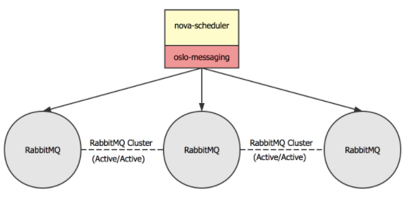

本文主要讨论openstack的高可用。
```
一、高可用基础
    1. 高可用架构的考量因素
    2. 冗余和故障转移
    3. 服务的分类
    4. HA的种类
    5. 集群和法定票数
二、云平台高可用架构
    1. 无状态服务
    2. 有状态服务
        2.1 rabbitMQ
        2.2 MySQL
        2.3 Ceph 集群
        2.4 memcached
        2.5 redis
        2.6 MongoDB
        2.7 Prometheus
```
# OpenStack HA
## 一、高可用基础
### 1.高可用架构的考量因素



高可用性一般从以下几个纬度来定义：
- 可用性（availability），是关于系统可供使用时间的表述，以不可用的时间为衡量指标。不可用时间越短，可用性越高。通常用 n 个 9 来描述。比如 4 个 9 的可用性（99.99%），是指一年中不可用时间在 52 分钟内，平均每周不可用时间在 1 分钟。
- 可靠性（reliability），是关于系统无故障时间间隔的描述，以发生故障的次数为衡量指标，故障次数越少，可靠性越高。可靠性也用于描述数据可靠性，即存储的数据是否能保持一致，并且能保证不丢失数据。
- 可维护性（maintainability），是指系统发生故障后，恢复的时间来描述。时间越短，可维护性越高。

通常用以下两个指标来衡量高可用：

- RTO （Recovery Time Objective） 服务恢复时间
- RPO（Recovery Point Objective）是切换时向前恢复的数据的时间长度


  
架构的高可用一般是为了解决或减少这两个问题：
- 系统或服务的宕机时间
- 数据丢失

### 2. 冗余和故障转移
为了解决上面两种情况造成的系统或服务不可用，我们通常采用冗余和故障转移来设计高可用的架构。
- 冗余

冗余指的是在架构中使用冗余的硬件设备，并且运行多个互相冗余的服务实例来实现高可用，例如交换机，服务器，电源，网卡等硬件的冗余，以及系统中运行服务的软件冗余。如果某个硬件出现故障，系统可以转移使用另一个运行在没有故障的硬件上的服务，来保证服务的可用性。
- 故障转移

除了将硬件和软件冗余之外，还需要实现故障转移的机制，这种机制可以是由程序自动实现，也可以是人为实现。其目的就是当服务不可用时，将服务的请求转移到其他可用的服务上去。
通过冗余和故障转移，我们能够减少和避免出现单点故障(single points of failure),提高系统的可用性。

### 3. 服务的分类
- 无状态服务

对服务的每一个请求都是互相独立的，前后请求没有依赖关系。对于这类服务的高可用，可以运行多个冗余的服务实例，并在这些服务之间进行负载均衡调度即可。 OpenStack 中的无状态服务包括：nova-api, nova-conductor, nova-scheduler, glance-api, keystone-api, neutron-api 等等。

- 有状态服务

对服务的一个请求可能依赖于前一个请求的结果。有状态服务比较难管理，这类服务的高可用可以采用 active/active 的主主模型或 active/passive 
的主备模式。数据库，消息队列都属于有状态服务。
### 4. HA 的种类
- 主备模式
  
主备模式下，一般运行多个服务实例，但只有一个主服务对外提供服务，其余都为备用服务实例，备用服务一般不可提供写入数据的功能。当主服务不可用时，
备用服务成为新的「主」，开始对外提供服务。通常这种模式需要一个 VIP 作为服务的访问入口，还需要额外的程序（如 Pacemaker 和 Corosync） 来监控服务状态，并对服务进行管理，比如主备自动切换。

- 主主模式
  
主主模式下，服务的每一个实例都可以作为主服务对外提供服务。当某个主服务不可用时，将请求转到其他可用的主服务即可。通常这种模式需要使用负载均衡程序来将请求调度到不通的服务上，同时进行服务的健康状态检测，比如HAProxy。

### 5.集群和法定票数（quorom）
很多有状态服务可以组成集群来对外提供服务，集群一般可以提供数据同步，状态转换等功能。
法定票数（quorom）指的是一个集群可以正常工作时，集群内部节点所需要拥有的最少票数。在不考虑节点硬件差异的情况时，
一般来说，集群内部的每个节点拥有的票数为 1。一般来说法定票数需要大于集群数的一半。例如，集群数为4，那么法定票数为3，集群数为3，法定票数为2。
为了防止集群出现分裂成内部节点数相等的两个集群（脑裂，split brain）， 集群的数量一般为奇数个。

## 二、云平台高可用架构
云环境的HA，包括以下几个方面:
- 应用的 HA
- 虚机的 HA
- 云控制服务的 HA
- 物理IT层：包括网络设备比如交换机和路由器，存储设备等
- 基础设施，比如电力、空调和防火设施等

接下来主要介绍OpenStack中的高可用，在 OpenStack 中，我们将节点分成下面几种角色：
- 控制节点
  
运行所有的基础服务和 OpenStack API 服务，调度服务等。数据库，消息队列，负载均衡，nova-api，nova-scheduler，cinder-api，cinder-scheduler，neutron-api 这些服务都运行 在控制节点上。控制节点不会运行租户的虚拟机，一般来说控制节点不可用不会影响租户的业务。

- 计算节点
  
运行 nova-compute，libvirtd，neutron-openvswitch-agent 服务，平台中租户的虚拟机都运行在计算节点上。
- 网络节点
  
运行 neutron-l3-agent，neutron-dhcp-agent，neutron-lbaas-agent 等服务，对租户提供路由，负载均衡，DHCP 等网络服务。
- 存储节点
  
运行分布式存储 Ceph，包含 ceph-monitor 和 ceph-osd，对租户提供存储服务，如虚拟机的镜像存储，云硬盘等。
### 1. 无状态服务
在控制节点上，运行了很多无状态服务，
一类是各 OpenStack API 服务，如 nova-api, cinder-api 等，
一类是各 OpenStack 组件内部的服务如 nova-novncproxy, nova-consoleauth, nova-scheduler, cinder-scheduler 等，
还有一类是无状态的基础服务，如 HAProxy、Keepalived.

对于各组件内部的服务，只需要启动多个实例即可，这些服务会连接到 RabbitMQ 集群，多个服务实例能够保证一个在某个实例不可用时其他实例能够从处理消息队列上的消息，保证服务可用性。


对于 API 服务，这些服务都是通过 HTTP 协议来对外提供服务的。这些服务的高可用，我们也需要在每个控制节点上启动冗余的服务实例，
使用同时 HAProxy 来进行 7 层反向代理，将请求调度到可用的服务实例上，HAProxy 还能够对服务进行检测，如果某个服务实例不可用，
HAProxy 将不会把后续请求调度到此服务实例，而是由剩余的可用服务实例来对外提供服务。



三节点上都部署keepalived服务，提供业务VIP和数据库VIP，用户通过业务VIP访问业务api，请求达到HAProxy，haproxy来进行7层反向代理，将请求调度到可用的服务实例上，然后HAProxy将请求发给Nginx，Nginx根据监听的端口号调用相应的实例服务。

### 2. 有状态服务
控制节点上，还运行了一些有状态的服务。如 RabbitMQ, MySQL, Memcached。对于这些有状态服务，我们都使用 active/active 的主主模式进行数据复制，每个运行的服务实例都可以直接对外提供服务，不需要进行状态转换。
#### 2.1 rabbitMQ
rabbitmq的基本结构如下图所示：



- Broker：消息队列服务进程，此进程包括两个部分：Exchange和Queue
- Exchange：消息队列交换机，按一定的规则将消息路由转发到某个队列，对消息进行过虑。
- Queue：消息队列，存储消息的队列，消息到达队列并转发给指定的
- Producer：消息生产者，即生产方客户端，生产方客户端将消息发送
- Consumer：消息消费者，即消费方客户端，接收MQ转发的消息。

“消息队列”是在消息的传输过程中保存消息的容器。它是典型的：生产者、消费者模型，消息队列的典型应用场景有：

- 任务异步处理

高并发环境下，由于来不及同步处理，请求往往会发生堵塞，比如说，大量的insert，update之类的请求同时到达MySQL，直接导致无数的行锁表锁，甚至最后请求会堆积过多，从而触发too many connections错误。通过使用消息队列，我们可以异步处理请求，从而缓解系统的压力。将不需要同步处理的并且耗时长的操作由消息队列通知消息接收方进行异步处理。减少了应用程序的响应时间。

- 应用程序解耦合

MQ相当于一个中介，生产方通过MQ与消费方交互，它将应用程序进行解耦合。



Exchange类型有以下几种：

- Fanout：广播，将消息交给所有绑定到交换机的队列
- Direct：定向，把消息交给符合指定routing key 的队列
- Topic：通配符，把消息交给符合r outing pattern（路由模式） 的队列
- Header：header模式与routing不同的地方在于，header模式取消routingkey，使用header中的 key/value（键值对）匹配队列。

RabbitMQ集群中节点包括内存节点、磁盘节点。一个集群需要至少有一个disc节点，一个RAM节点。
内存节点将所有的队列，交换器，绑定关系，用户，权限，和vhost的元数据信息保存在内存中。而磁盘节点将这些信息保存在磁盘中，但是内存节点的性能更高，
为了保证集群的高可用性，必须保证集群中有两个以上的磁盘节点，来保证当有一个磁盘节点崩溃了，集群还能对外提供访问服务。

RabbitMQ 服务自身支持集群，因此我们在三个控制节点上分别启动 RabbitMQ 实例，组成高可用的集群。这样即使某个 RabbitMQ 服务不可用，
其余 RabbitMQ 节点也能够正常对外提供服务。 在客户端，即需要使用 RabbitMQ 的服务中，利用如 oslo-messaging 库的功能，
来检测 RabbitMQ 的健康状态。如果某个 RabbitMQ 服务不可用，客户端将使用其他可用的 RabbitMQ 服务。



rabbitmq部署支持以下模式：

(1) 单一模式

单机，即单机情况不做集群，就单独运行一个 RabbitMQ 而已。

(2) 普通集群模式

默认模式，A，B节点，消息从A节点进入，从B节点消费.
rabbitMQ中的exchange和queue都包含meta、contents、state等信息,exchange在集群中的每个节点都保存一份数据，
但是queue不一样，queue在集群中对于contents只存储一份，其他节点只存储meta信息

(3) 镜像集群模式(常用)

镜像模式：mirror镜像模式，实现数据的同步2-3节点，对于100%数据可靠性，采用3节点。
一般配合HAProxy配置为高可用集群，把需要的队列做成镜像队列，存在于多个节点，属于 RabbitMQ 的 HA 方案。该模式解决了普通模式中的问题，其实质和普通模式不同之处在于，消息实体会主动在镜像节点间同步，而不是在客户端取数据时临时拉取。该模式带来的副作用也很明显，除了降低系统性能外，如果镜像队列数量过多，加之大量的消息进入，集群内部的网络带宽将会被这种同步通讯大大消耗掉。所以在对可靠性要求较高的场合中适用。
完成镜像队列设置之后，每各队列会被复制到各个节点，各个节点状态保持一致。因为 RabbitMQ 本身不提供负载均衡，需要搭建负载均衡器来提供负载转发，可以选择 HAProxy 和 Nginx。
在实现机制上，mirror queue内部实现了一套选举算法，有一个master和多个slave,queue中的消息以master为主，对于publish，可以选择任意一个节点进行连接，rabbitmq内部若该节点不是master，则转发给master，master向其他slave节点发送该消息。
以上两种集群的方案对于客户端来讲，都需要考虑节点的失效。
客户端可以容错性的方式连接rabbitMQ集群，比如失效重连下一个节点等。
也可以在客户端和mq之间加一个LoadBalancer,如HAProxy,做负载均衡，失效转发用。

(4) 主备模式

一般在并发和数据量不高的情况下，这种模式非常的好用且简单。主备模式也称之为Warren模式。主备方式(active,passive)只有一个节点处于服务状态，可以结合pacemaker和ARBD。
也叫Warren（兔子窝）模式，同一时刻只有一个节点在工作（备份节点不能读写），当主节点发生故障后会将请求切换到备份节点上（主恢复后成为备份节点）。需要借助HAProxy之类的（VIP模式）负载均衡器来做健康检查和主备切换，底层需要借助共享存储（如SAN设备）。

主节点挂了后，由HaProxy进行选择备份节点来做主节点。

listen rabbitmq_cluster 监听rabbitmq集群
bind ip:5672 绑定ip和默认端口5672
balance roudrobin 随机的选择备份节点来做主节点

(5) 远程模式

远程模式可以实现双活的一种模式，简称 shovel 模式，所谓的 shovel 就是把消息进行不同数据中心的复制工作，可以跨地域的让两个 MQ 集群互联，远距离通信和复制。
Shovel是一个插件，用于实现跨机房数据复制，或者数据迁移，故障转移与恢复等。

(6) 多活模式(Federation，异地数据复制的主流模式)

也是实现异地数据复制的主流模式，因为 shovel 模式配置比较复杂，所以一般来说，实现异地集群的都是采用这种双活 或者 多活模型来实现的。这种模式需要依赖 rabbitMQ 的 federation 插件，可以实现持续的，可靠的 AMQP 数据通信，多活模式在实际配置与应用非常的简单。

rabbitmq集群部署命令
```
# rabbitmqctl stop_app
# rabbitmqctl join_cluster  rabbit@node1
# rabbitmqctl start_app
# rabbitmqctl change_cluster_node_type ram
# rabbitmqctl cluster_status
# rabbitmqctl set_policy mirror_queue1 "^" '{"ha-mode":"all","ha-sync-mode":"automatic","ha-promote-on-shutdown":"always"}'
# rabbitmqctl set_policy ha-all '^(?!amq\.).*' '{"ha-mode":"all"}'
# rabbitmqctl list_policies
```

**镜像队列的故障恢复：**
```
前提：两个节点(A和B)组成一个镜像队列。
场景1：A先停，B后停。 该场景下B是master（disk，A是ram），只要先启动B，再启动A即可。或者先启动A，再在30秒之内启动B即可恢复镜像队列。
场景2: A, B同时停。 该场景可能是由掉电等原因造成，只需在30秒之内连续启动A和B即可恢复镜像队列。
场景3：A先停，B后停，且A无法恢复。 该场景是场景1的加强版，因为B是master，所以等B起来后，在B节点上调用rabbitmqctl forget_cluster_node A，解除与A的cluster关系，再将新的slave节点加入B即可重新恢复镜像队列。
场景4：A先停，B后停，且B无法恢复。 该场景是场景3的加强版，比较难处理，早在3.1.x时代之前貌似都没什么好的解决方法，但是现在已经有解决方法了，在3.4.2版本亲测有效（我们当前使用的是3.3.5）。因为B是master，所以直接启动A是不行的，当A无法启动时，也就没办法在A节点上调用rabbitmqctl forget_cluster_node B了。新版本中，forget_cluster_node支持–offline参数，offline参数允许rabbitmqctl在离线节点上执行forget_cluster_node命令，迫使RabbitMQ在未启动的slave节点中选择一个作为master。当在A节点执行rabbitmqctl forget_cluster_node –offline B时，RabbitMQ会mock一个节点代表A，执行forget_cluster_node命令将B剔出cluster，然后A就能正常启动了。最后将新的slave节点加入A即可重新恢复镜像队列。
场景5: A先停，B后停，且A、B均无法恢复，但是能得到A或B的磁盘文件。 该场景是场景4的加强版，更加难处理。将A或B的数据库文件(默认在$RABBIT_HOME/var/lib目录中)拷贝至新节点C的目录下，再将C的hostname改成A或B的hostname。如果拷过来的是A节点磁盘文件，按场景4处理方式；如果拷过来的是B节点磁盘文件，按场景3处理方式。最后将新的slave节点加入C即可重新恢复镜像队列。
场景6：A先停，B后停，且A、B均无法恢复，且无法得到A或B的磁盘文件。 洗洗睡吧，该场景下已无法恢复A、B队列中的内容了。
```
#### 2.2 MySQL
对于有状态的数据库系统实现高可用，一般业界有如下实践方法：
```
主备模式：单活，容量对等，可以实现故障转移。使用独立存储时需要借助复制、镜像同步等技术，数据会有延迟、不一致等问题（CAP定律），使用共享存储时就不会有状态同步这个问题。
主从模式：一定程度的双活，容量对等，最常见的是读写分离。通常也需要借助复制技术，或者要求上游实现双写来保证节点数据一致。
主主模式：两边都可以读写，互为主备。如果两边同时写入很容易冲突，所以通常实现的都是“伪主主模式”，或者说就是主从模式的升级版，只是新增了主从节点的选举和切换。
分片集群：不同节点保存不同的数据，上游应用或者代理节点做路由，突破存储容量限制，分摊读写负载；典型的如MongoDB的分片、MySQL的分库分表、Redis集群。
异地多活：“两地三中心”是金融行业经典的容灾模式（有资源闲置的问题），“异地多活”才是王道。
```

本文中，每个控制节点上都会运行数据库服务，我们使用 MariaDB 将多个数据库组成 Galera Cluster 集群。Galera Cluster 集群是一个主主模式的集群，同时使用同步的方式进行数据库复制，任何时刻任意数据库节点都可读可写。这样能够保证数据库的宕机不会造成任何数据丢失，同时可以直接进行数据库的切换，且无需进行主备状态转换。


#### 2.3 Ceph 集群
Ceph是一个统一的分布式存储系统，设计初衷是提供较好的性能、可靠性和可扩展性。 Ceph 存储集群至少需要一个 Ceph Monitor 和两个 OSD 守护进程。

#### 2.4 memcached
Memcached是一个开源的、高性能的分布式对象缓存系统，通过把经常存取的对象或数据缓存在内存里，这些数据以键值对的形式存放在内存上的HASH表里。
Memcached在解决大规模集群数据缓存上具有很大的优势，易于二次开发，并且开放式的API使其十分受开源项目的欢迎，
OpenStack就使用了Memcached作为缓存系统。主要应用在以下场景中：

- 存储函数执行结果： keystone heat nova等项目把一些固定的属性和查询请求的结果放到cache里面，加速访问
- 存储keystone token token创建完成之后，不需要修改，会有大量的读操作，适合放到cache中
- 存储keystonemiddleware token 为neutron，cinder，nova等各个项目缓存从keystone获得的token。
- 存储horizon用户会话数据 主要是django支持使用

memcache 集群方案：
```
A. 客户端直接访 问多个memcache 实例
优点：简单，未引入新的节点；
缺点：维护不方便，未实现集中管理；性能不满足，实例宕机后不能自动踢出（hash到该实例的请求都要等到超时才能转到其他正常实例）。
B. magent代理
优点：简单，满足缓存对代理的大部分要求；
缺点：无成熟案例；性能不满足，实例宕机后不能自动踢出。
C. moxi代理
优点：功能丰富，提供本地缓存、Memcache实例数据复制等。
缺点：无成熟案例；代码很久没更新。
D. twemproxy代理
优点：twitter的成熟案例。
缺点：主要配合是twemproxy+redis，与memcache配合使用的案例较少；不支持缓存的复制功能。
E. mcrouter
优点：facebook的成熟案例；功能强大，支持Memcache实例分组、实例复制功能，实例宕机后可自动踢出。
缺点：一般用于ubuntu平台，在centos上安装较复杂。
```
使用Memcached前应当注意
- Memcached服务单点故障

在Memcached集群中每个节点独立存取数据，节点之间没有数据同步机制。如果一个Memcached节点出现故障，那么这个节点缓存的所有数据都会丢失，
但是不必担心，因为真正的数据仍保存在数据库中，重启节点之后只要再次访问该数据就会再次从数据库缓存到Memcached服务器。
- 存储空间限制

Memcached缓存系统的数据存储在内存里，必然会受到内存大小的影响。32位系统可缓存的数据最大为2G，64位系统缓存的数据大小没有限制，只要物理内存足够。
- 存储单元限制

Memcached缓存系统以键值对为单元进行数据存储，key最大为250个字节，value最大为1MB，超过则无法存储。
- 数据碎片

Memcached缓存系统的内存存储单元按照Chunk分配，value的数据不可能全部正好等于Chunk的大小，因此必然会出现内存碎片浪费空间。
- 利旧算法的局限性

Memcached缓存系统的LRU算法，并不针对全局空间的存储数据，而是针对Slab，Slab是Memcached中多个Chunk的集合。
- 数据访问安全性

Memcached缓存系统本身没有安全机制，通过非加密的Telnet即可对Memcached服务器端的数据进行操作，因此在面向internet的系统架构中，Memcached服务器通常位于用户的安全区域。
#### 2.5 redis
redis集群的部署，采用**一主二从三哨兵**
- redis主从复制

从节点作用： 从节点扩展主节点的读能力，分担主节点读压力
一旦主节点宕机，从节点作为主节点的备份可以随时顶上来
- redis主从切换Sentinel(哨兵)

(1) 手动主从切换
```src/redis-cli -p 6380 slaveof NO ONE```

(2) 自动主从切换

官方建议sentinel至少部署三台，且分布在不同机器。这里主要考虑到sentinel的可用性，假如我们只部署了两台sentinel，且quorum设置为1，
也可以实现自动故障迁移，但假如其中一台sentinel挂了，就永远不会触发自动故障迁移，因为永远达不到大多数sentinel认定master主观下线了。
Sentinel支持集群（可以部署在多台机器上，也可以在一台物理机上通过多端口实现伪集群部署）
很显然，只使用单个sentinel进程来监控redis集群是不可靠的，当sentinel进程宕掉后(sentinel本身也有单点问题)整个集群系统将无法按照预期的方式运行。
所以有必要将sentinel集群，这样有几个好处：
1）即使有一些sentinel进程宕掉了，依然可以进行redis集群的主备切换；
2）如果只有一个sentinel进程，如果这个进程运行出错，或者是网络堵塞，那么将无法实现redis集群的主备切换（单点问题）;
3）如果有多个sentinel，redis的客户端可以随意地连接任意一个sentinel来获得关于redis集群中的信息。
[自动切换原理](https://www.cnblogs.com/kevingrace/p/9004460.html)

#### 2.6 MongoDB
- 部署架构1：Replica Set



- 部署架构2：sharding



- 部署架构3：Master-Slave

基于主从复制,会有如下问题
```
1.主节点挂了能否自动切换连接（目前需要手工切换）
2.主节点的读写压力过大如何解决
3.从节点每个上面的数据都是对数据库全量拷贝，从节点压力会不会过大
4.数据压力大到机器支撑不了的时候能否做到自动扩展
```

#### 2.7 Prometheus
Prometheus的体系结构及其某些生态系统组件如下：

