# Getting Started with Heat
Date: 2016/9/10 17:45:07

[Heat Documentation](https://docs.openstack.org/heat/latest/)

[heat template guide](https://docs.openstack.org/heat/latest/template_guide/index.html)

[heat architecture](https://docs.openstack.org/heat/latest/developing_guides/architecture.html)

[heat resource type](https://docs.openstack.org/heat/latest/template_guide/openstack.html)

[heat software configuration](https://docs.openstack.org/heat/latest/template_guide/software_deployment.html)

## 1. Heat Introduction

Heat 是由AWS的EC2 Cloud Formation
演化而来，是openstack中负责Orchestration的service, 用于openstack
中资源的编排，它通过将OpenStack中的资源（resource）以模版（template）的形式组织起来。
例如我们可以将一组资源，比如虚拟机实例的启动、IP绑定、软件部署等写在一个template里面，
heat 通过读取配置文件来完成模版规定的动作：创建虚拟机，associate
floatingip，deploy application 等等。 Heat
将从这个template中创建出来的一组资源称之为“资源栈”(stack)。当对这一组资源进行操作时，
只需要对stack进行操作，所以heat很适合批量资源的创建和销毁，它将一系列繁琐的人工操作自动化了起来。

Orchestration 可以理解为自动化部署、配置（provisioning and deployment）。
除了资源的部署之外，还有一方面是server上应用软件的安装配置。
当需要部署多个节点的时候,节点之间的依赖关系,部署顺序和配置都可以交给heat来管理。

除此之外, heat
还可以和openstack的监控（telemetry）服务Ceilometer一起实现自动伸缩，
所以我们可以在heat的模版中定义一个scaling group作为一个资源。

## 2. 什么是Heat

Heat向开发人员和系统管理员提供了一种简便地创建和管理一批相关的OpenStack资源的方法，
并通过有序且可预测的方式对其进行资源配置和更新。
用户可以使用Heat的示例模板或自己创建模板来描述OpenStack资源以及应用程序运行时所需的任何相关依赖项或运行时参数。

当设置完成后，可通过按授权控制、可预测的方式修改和更新OpenStack资源。
用户可以通过OpenStack管理控制台、Heat命令行工具或API对模板及其相关的资源集进行设置和更新。

## 3. 为什么需要Heat

### 3.1 更快更有效的管理OpenStack的资源
云平台系统在相对比较稳定的情况下，管理成本逐渐变成首要的解决问题。
云上自动化能力是一个云平台的刚需，可以有效降低维护难度。

OpenStack原生提供命令行和Horizon
来供用户管理资源。然而命令行和在浏览器中的点击，费时费力，不利于用户使用Openstack
来进行大批量的管理以支撑IT
应用。如下图所示，openstack中有众多的资源，对应了很多繁琐的操作。

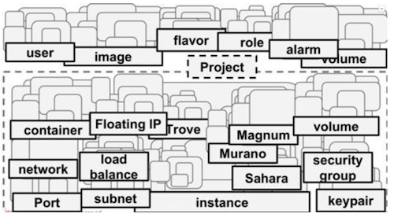

Heat 在这种情况下应运而生.

如下图所示，我们可以将一些零散的资源操作都定义在heat的模版中，
通过一个创建stack的操作，就能创建出我们要的资源。Heat
采用模板方式来设计或者定义编排。 为方便用户使用，Heat
还提供了大量的模板例子，使用户能够方便地得到想要的编排。

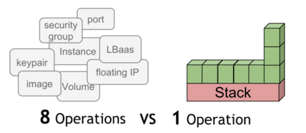

### 3.2 更小的研发成本

引入Heat，对于不了解OpenStack的研发者来说，可以更快的接入现有的业务系统。开发者更关心的是授权认证和对虚拟资源的增删改，而对于底层的状态并不用太多了解。

## 4. Heat 术语

### 4.1 Stack

Stack概念来源于AWS，是OpenStack中用来管理一组资源的基本单位。一个stack往往对应一个应用程序。Stack管理的是resource，而resource是个抽象的概念，它可以是虚拟机，可以是网络等。

Stack就是在单个模板中定义的实例化资源的集合，是Heat管理应用程序的逻辑单元。

### 4.2 template
heat的template描述了所用的所有组件资源以及组件资源之间的关系。heat模版是heat的核心。

####  4.2.1 resource

资源是底层服务的抽象，CPU、memory、disk、网络等都可以看作是资源。一个stack可以拥有很多资源。资源和资源之间会存在依赖关系。Heat在创建栈的时候会自动解析依赖关系，按顺序创建资源。在heat的template中，resources用于模板中资源的声明，在HOT模板中，应该至少有一个资源的定义，否则在实例化模板时将不会做任何事情。

#### 4.2.2 parameters
heat模板中的参数，定义在创建或更新stack时可以传递哪些参数来定制模板。

#### 4.2.3 parameter_groups
用于指定如何对输入参数进行分组，以及提供参数的顺序。

#### 4.2.4 Outputs
heat模板中的顶级key，定义实例化后stack将返回的数据。

模版中包括七个部分：heat_template_version、description、parameter_groups、parameters、resources、outputs、conditions。除了heat_template_version和resources，其它都是可选部分。

## 5. Heat Architecture
Heat 是openstack 中上层的一个服务，如下图所示：

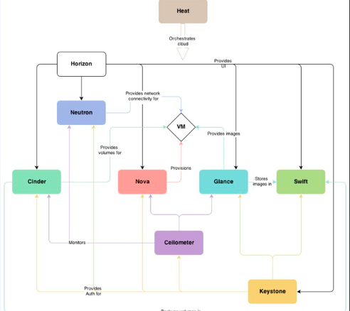

它位于其它基础组件的上层，可以将其它组件的资源以模版的形式组织起来， 如下图：

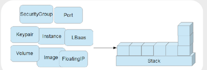

### 5.1 heat 组件

Heat 由以下组件组成：

- Heat-api:实现openstack天然支持的REST API。该组件通过把API请求经由AMQP传送给Heat engine 来处理API请求。

- Heat-api-cfn:提供兼容AWSCloudFormation的API,同时也会把API请求通过AMQP转发给Heat engine。

- Heat-engine: heat-engine是heat中的核心模块，处理主要的逻辑业务。此模块提供heat最主要的功能，执行模板内容，最终完成应用系统的创建和部署，并把执行结果返回给API调用者。当heat engine 拿到请求后，会把请求解析为各种类型的资源，每种资源都对应OpenStack 其它的服务客户端，然后通过发送REST 的请求给其它服务。通过如此的解析和协作，最终完成请求的处理。

- heatclient：CLI通过与heat-api通信，来调用API实现相关功能。终端开发者可以直接使用编排REST API。

- heat-cfntools：独立于heat组件的一个的工具，需要单独下载。这个工具用来完成虚拟机实例内部的操作配置任务。在创建虚拟机镜像时，需要在镜像中安装heat-cfntools工具。

- heat-api-cloud-watch: 负责资源监控的,现在已经不再用了。

Heat 中各个组件调用逻辑如下图所示:

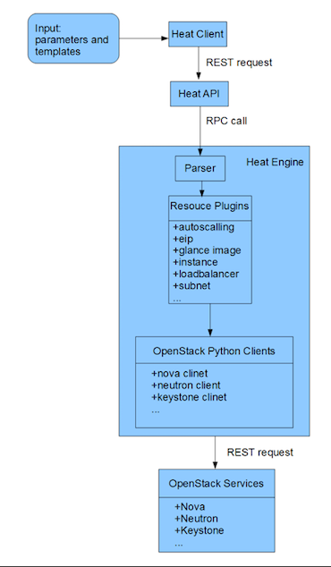

Heat 主要分为 heat client,heat api,heat engine. 调用逻辑如下 :

Heat client 接受输入命令, 参数 , 和模板 (URL,
文件路径or数据),处理信息后转为REST API 求发送到heat-api 服务.Heat API
服务接受请求 , 读入模板信息 , 处理后 利用rpc请求发送给 heat-engine.
heat-engine 解析template数据,调用各种资源插件 , 然后各种资源插件通过 openstack
的 clients 发送指 令给 openstack 服务 .

## 6. Use Heat
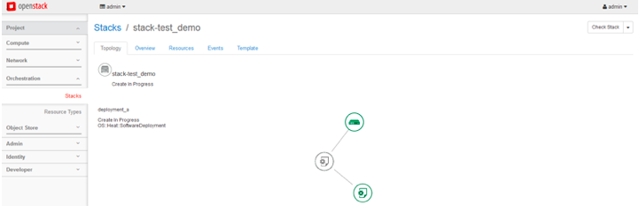

 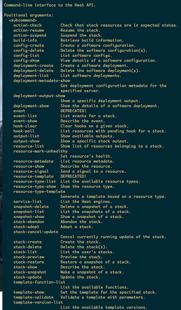

### 6.1 对基础架构的编排
对于不同的资源，Heat 都提供了对应的资源类型。比如对于VM， Heat
提供了`OS::Nova::Server`。`OS::Nova::Server`
有一些参数，比如key、image、flavor等，这些参数可以直接指定，可以由客户在创建Stack
时提供，也可以由上下文其它的参数获得。创建一个VM的模板如下：
```
heat_template_version: 2013-05-23

description: >
  HOT template to create a new neutron network plus a router to the public
  network, and for deploying three servers into the new network. The template also
  assigns floating IP addresses to each server so they are routable from the
  public network.

parameters:
  key_name:
    type: string
    description: Name of keypair to assign to servers
    default: dxl-key
  image:
    type: string
    description: Name of image to use for servers
    default: cirros-0.3.5
  flavor:
    type: string
    description: Flavor to use for servers
    default: m1.tiny
  public_net:
    type: string
    description: >
      ID or name of public network for which floating IP addresses will be allocated
    default: public
  private_net_name:
    type: string
    description: Name of private network to be created
    default: private_test_net
  private_net_cidr:
    type: string
    description: Private network address (CIDR notation)
    default: 182.168.1.1/24
  private_subnet_name:
    type: string
    description: Private subnet name
    default: private_test_subnet

resources:
  private_net:
    type: OS::Neutron::Net
    properties:
      name: { get_param: private_net_name }
  private_subnet:
    type: OS::Neutron::Subnet
    properties:
      name: {get_param: private_subnet_name}
      network_id: { get_resource: private_net }
      cidr: { get_param: private_net_cidr }
  router:
    type: OS::Neutron::Router
    properties:
      external_gateway_info:
        network: { get_param: public_net }
  router_interface:
    type: OS::Neutron::RouterInterface
    properties:
      router_id: { get_resource: router }
      subnet_id: { get_resource: private_subnet }

  servers:
    type: OS::Heat::ResourceGroup
    properties:
      count: 1
      resource_def:
        type: OS::Nova::Server
        properties:
          image: { get_param: image }
          flavor: { get_param: flavor }
          key_name: { get_param: key_name }
          networks:
            - network: { get_resource: private_net }
```
### 6.2 对软件配置和部署的编排

Heat提供了多种资源类型来支持对于软件配置和部署的编排，如下所列：

- `OS::Heat::CloudConfig`：VM 引导程序启动时的配置，由`OS::Nova::Server`
  引用

- `OS::Heat::SoftwareConfig`：描述软件配置

- `OS::Heat::SoftwareDeployment`：执行软件部署

- `OS::Heat::SoftwareDeploymentGroup`：对一组VM 执行软件部署

- `OS::Heat::SoftwareComponent`：针对软件的不同生命周期部分，对应描述软件配置

- `OS::Heat::StructuredConfig`：和`OS::Heat::SoftwareConfig`
  类似，但是用Map 来表述配置

- `OS::Heat::StructuredDeployment`：执行`OS::Heat::StructuredConfig`
  对应的配置

- `OS::Heat::StructuredDeploymentsGroup`：对一组VM
  执行`OS::Heat::StructuredConfig` 对应的配置

其中最常用的是`OS::Heat::SoftwareConfig`
和`OS::Heat::SoftwareDeployment`。

#### 6.2.1 `OS::Heat::SoftwareConfig`

下面是`OS::Heat::SoftwareConfig` 的用法，它指定了配置细节。

```
resources:

    install_db_sofwareconfig

        type: OS::Heat::SoftwareConfig

            properties:

            group: script

        outputs:

    - name: result

        config: |
        
        #!/bin/bash -v
        
        yum -y install mariadb mariadb-server httpd wordpress
        
        touch /var/log/mariadb/mariadb.log
        
        chown mysql.mysql /var/log/mariadb/mariadb.log
        
        systemctl start mariadb.service
```

#### 6.2.2 `OS::Heat::SoftwareDeployment`
下面是`OS::Heat::SoftwareDeployment`
的用法，它指定了在哪台服务器上做哪项配置。另外SofwareDeployment
也指定了以何种信号传输类型来和Heat 进行通信。

```
sw_deployment:

type: OS::Heat::SoftwareDeployment

properties:

config: { get_resource: install_db_sofwareconfig }

server: { get_resource: server }

signal_transport: HEAT_SIGNAL
```
#### 6.2.3 `OS::Heat::SoftwareConfig`和`OS::Heat::SoftwareDeployment` 执行流程

`OS::Heat::SoftwareConfig`和`OS::Heat::SoftwareDeployment`协同工作，需要一系列Heat工具的自持。这些工具都是OpenStack的子项目。

首先，`os-collect-config`调用Heat
API拿到对应VM的metadata。当metadata更新完毕后`os-refresh-config`开始工作了，它主要是运行下面目录所包含的脚本：

```
/opt/stack/os-config-refresh/pre-configure.d
/opt/stack/os-config-refresh/configure.d
/opt/stack/os-config-refresh/post-configure.d
/opt/stack/os-config-refresh/migration.d
/opt/stack/os-config-refresh/error.d
```
每个文件夹都应对了软件不同的阶段，比如预先配置阶段、配置阶段、后配置阶段和迁移阶段。如果任一阶段的脚本执行出现问题，它会运行error.d目录里的错误处理脚本。os-refresh-config 在配置阶段会调用一定预先定义的工具，比如heat-config，这样就触发了heat-config的应用，调用完heat-config后，又会调用os-apply-config。存在在heat-config或者os-apply-config里的都是一些脚本，也叫钩子。Heat对于各种不同的工具提供了不同的钩子脚本。用户也可以自己定义这样的脚本。


等一切调用完成无误后，heat-config-notify
会被调用，它用来发信号给Heat，告诉这个软件部署的工作已经完成。当Heat
收到heat-config-notify 发来的信号后，  
它会把`OS::Heat::SoftwareConfig`
对应资源的状态改为Complete。如果有任何错误发生，就会改为CREATE_FAILED 状态。

**OS::Heat::SoftwareConfig 和OS::Heat::SoftwareDeployment 执行流程如下：**

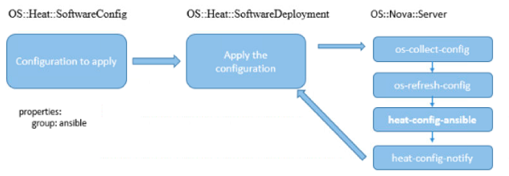

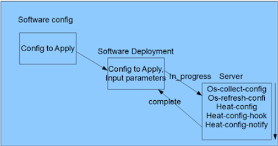

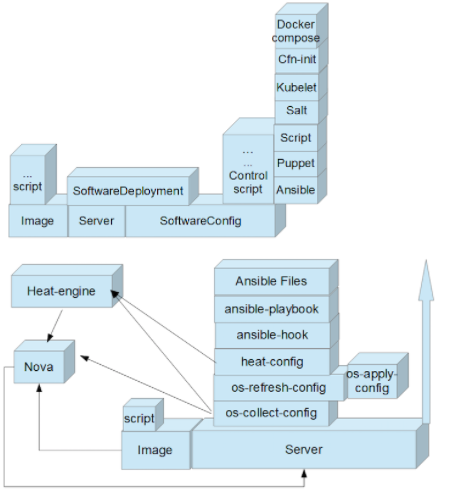

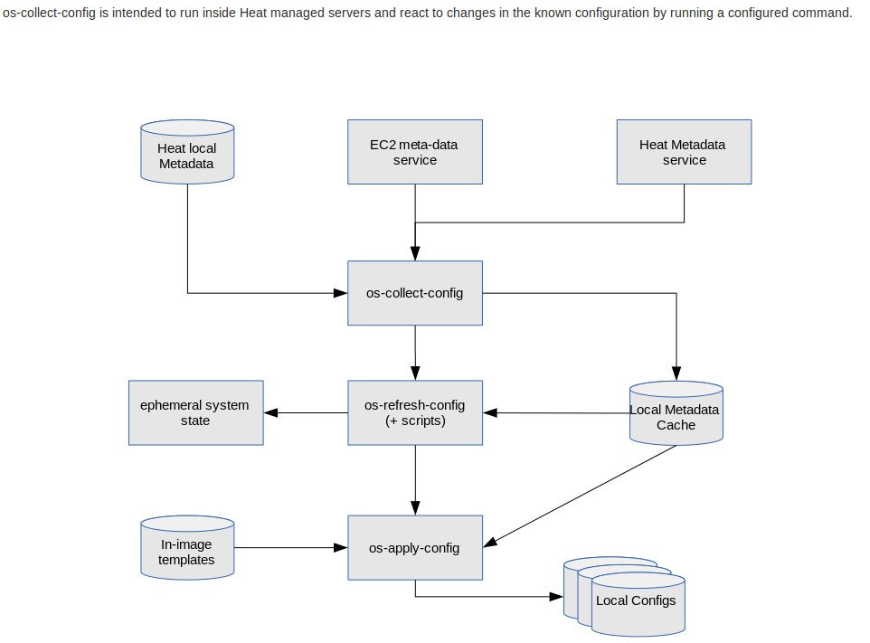

## 7. Heat AutoScalling
基础架构的自动伸缩是一个很高级的功能。Heat提供自动伸缩组`OS::Heat::AutoScalingGroup`
和伸缩策略`OS::Heat::ScalingPolicy`，结合基于Ceilometer
的`OS::Ceilometer::Alarm`
实现了可以根据各种条件，比如负载，进行资源自动伸缩的功能。

Heat 自动伸缩的流程图如下：

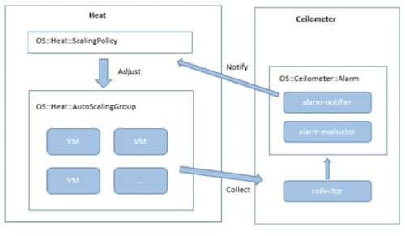

**定义自动伸缩组如下：**

```
auto_scale_group:

type: OS::Heat::AutoScalingGroup

properties:

min_size: 1

max_size: 4

```
**定义伸缩规则如下：**

```
server_scaleup_policy:

type: OS::Heat::ScalingPolicy

properties:

adjustment_type: change_in_capacity

auto_scaling_group_id: {get_resource: auto_scale_group}

cooldown: 60

scaling_adjustment: 1
```

**定义警报如下：**

```
cpu_alarm_high:

type: OS::Ceilometer::Alarm

properties:

description: Scale-up if the average CPU > 50% for 1 minute

meter_name: cpu_util

statistic: avg

period: 60

evaluation_periods: 1

threshold: 50

alarm_actions:

- {get_attr: [server_scaleup_policy，alarm_url]}

matching_metadata: {'metadata.user_metadata.stack': {get_param: "OS::stack_id"}}

comparison_operator: gt
```

## 8. Stack LifeCycle
整个 heat 就是围绕 stack 在玩 , 管理 stack 的生命周期.

ACTION +  STATUS

ACTIONS: 'CREATE', 'DELETE', 'UPDATE', 'ROLLBACK', 'SUSPEND', 'RESUME', 'ADOPT', 'SNAPSHOT', 'CHECK', 'RESTORE'
status: 'IN_PROGRESS', 'FAILED', 'COMPLETE'

## 9. stack domain users
[Heat Stack domain users](https://docs.openstack.org/admin-guide/orchestration-stack-domain-users.html)
