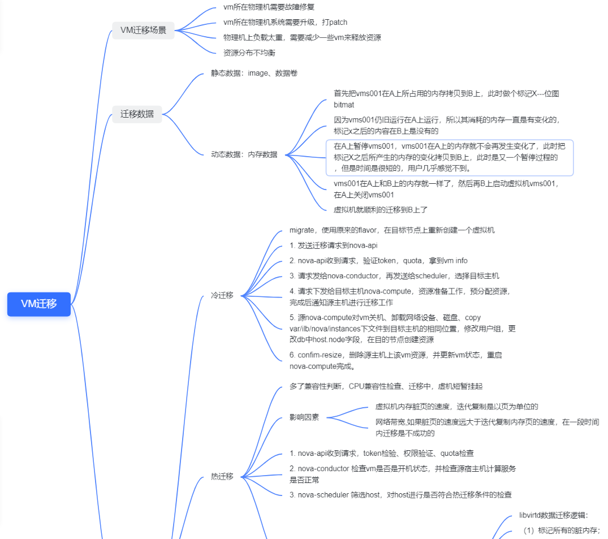
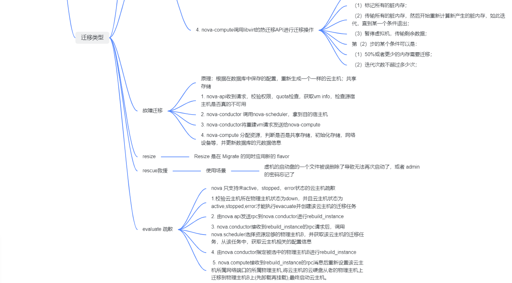

本文分析nova几个主要操作的流程
```
1. 创建虚拟机流程
2. VM 冷迁移过程
3. VM 热迁移过程
4. VM 迁移场景
5. VM 迁移数据
    - 静态数据
    - 动态数据
6. VM疏散    
```

## 1. Nova Create VM
虚拟机创建主要涉及到API、Conductor、Scheduler、Placement、Compute等主要服务。

1. nova client -> nova-api

nova client 先向keystone发送username，password，region_name 来申请一个有效的token，然后带着token发送给nova-api，nova-api收到请求先
向keystone验证token的有效性，然后处理一些关于参数校验、配额检测等事务，再向数据库写入虚拟机的初始信息。

1.1 参数校验

我们指定镜像和规格来创建一个虚拟机时，通常会使用：
```
nova --debug boot --image 81e58b1a-4732-4255-b4f8-c844430485d2 --flavor 1 --nic net-id=<> <vm_name>
```
我们可以看到虚拟机创建时，传入了一些诸如虚拟机名称、镜像、规格、个数、网络等基本信息。在API中，首先就会对这些参数进行校验，比如镜像ID是否合法、网络是否正确等。

1.2 配额检测 

2. nova-api到nova-compute
   
请求从nova-api发送到nova-conductor，nova conductor时db和nova-compute之间的桥梁，防止nova-compute直接访问数据库。同时也接管了一些比较
耗时的任务，比如build_instance, resize_instance,live_migrate_instance等。nova conductor将请求通过rpc_call转发给nova-scheduler,
scheduler通过filter 和weight选定一个合适的宿主机。并且更新db中host的信息。

3. nova-compute到hypervisor
请求到达宿主机所在的nova-compute，nova-compute通过调用glance client，neutronclient，cinderclient，做拉镜像、生成xml文件，创建网络
   define domain，start domain，直到libvirt检测到虚拟机的状态未running。则创建成功。
   
## 2. vm迁移

### 2.1 迁移场景



