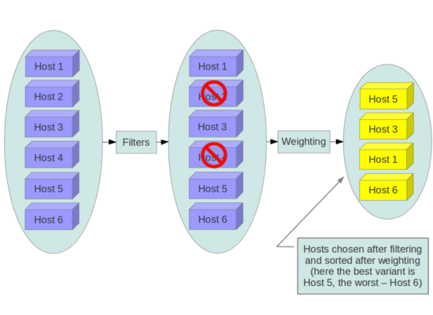
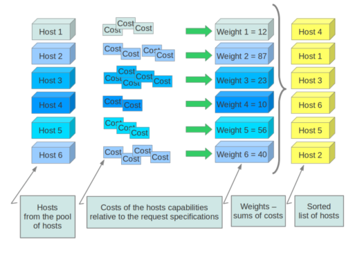

# Nova Scheduler
本文来看nova scheduler调度过程.

## 问题
在使用openstack集群的过程中，批量创建虚拟机，会发现虚拟机在多台物理机上的创建分布不均匀。为此，来学习下nova scheduler调度机制。

## nova scheduler 调度机制
Compute 使用nova-scheduler服务来确定如何分派计算请求，由nova-scheduler服务确定 VM 应在哪个主机上启动。nova scheduler的配置如下：
```
[scheduler]
driver = filter_scheduler
max_attempts = 10
discover_hosts_in_cells_interval = 600
workers = 7

[filter_scheduler]
available_filters = nova.scheduler.filters.all_filters
enabled_filters = AvailabilityZoneFilter, ComputeFilter, ComputeCapabilitiesFilter, ImagePropertiesFilter, ServerGroupAntiAffinityFilter, ServerGroupAffinityFilter
host_subset_size = 100
shuffle_best_same_weighed_hosts = false
```

Added a new boolean configuration option [filter_scheduler]shuffle_best_same_weighed_hosts (default is False).

Enabling it will spread instances between hosts that have the same weight according to request spec. It is mostly useful when the [filter_scheduler]host_subset_size option has default value of 1,

but available hosts have the same weight (e.g. ironic nodes using resource classes). In this case enabling it will decrease the number of rescheduling events.

On the other hand, enabling it will make packing of VMs on hypervizors less dence even when host weighing is disabled.

### 过滤、加权
Scheduler的作用就是在创建实例（instance）时，为实例选择出合适的主机（host）。这个过程分两步：过滤（Fliter）和计算权值（Weight）

1. 过滤：

过滤掉不符合我们的要求，或镜像要求（比如物理节点不支持64bit，物理节点不支持Vmware EXi等）的主机，留下符合过滤算法的主机集合。



2. 计算权值

通过指定的权值计算算法，计算在某物理节点上申请这个虚机所必须的消耗cost。物理节点越不适合这个虚机，消耗cost就越大，权值Weight就越大，调度算法会选择权值最小的主机。



主机根据/etc/nova/nova.conf文件中的以下选项加权，默认情况下，调度程序将实例均匀地分布在所有主机上。

| 参数 | 含义|
|-----|-----|
|ram_weight_multiplier|	内存权值，如果不使用此选项设置数值为负数，数值类型是浮点型，如果设置了ram_weight_multiplier 元数据，将覆盖此设置|
|build_failure_weight_multiplier	|用于权衡最近构建失败的主机。正值会增加主机最近报告的构建失败的重要性，从而降低它们被选中的可能性。如果设置了build_failure_weight_multiplier 元数据，则将覆盖配置选项值。|
|cpu_weight_multiplier | cpu权值，如果不使用此选项设置数值为负数，数值类型是浮点型，如果设置了cpu_weight_multiplier元数据，将覆盖此设置|
| cross_cell_move_weight_multiplier | | 	
|disk_weight_multiplier | 硬盘权值，如果不使用此选项设置数值为负数，数值类型是浮点型，如果设置了disk_weight_multiplier元数据，将覆盖此设置|
| io_ops_weight_multiplier|	用于称重主机 I/O 操作的乘数。负值表示优先选择轻工作负载计算主机。如果设置了io_ops_weight_multiplier 元数据，则此数将覆盖配置选项值。 |
| required | 指定如何处理不可用的仪表：True - 引发异常。为避免引发异常，应该使用调度程序过滤MetricFilter器过滤掉仪表不可用的主机。 False - 在加权过程中被视为负面因素（使用该weight_of_unavailable选项）。|
| scheduler_host_subset_size | 如果有N个机器的优先级相同，则随机选择scheduler_host_subset_size个，这个值必须为正整数，如果小于1则忽略，还原默认0 |
| scheduler_weight_classes	| 权重计算算法选择类，默认为nova.scheduler.weights.all_weighers. 然后对主机进行加权和排序，获得最大的权重。 |
| soft_affinity_weight_multiplier	| 主机分组亲和性权重。只允许正值。 |
| soft_anti_affinity_weight_multiplier | 称重主机，用于组软反亲和性。只允许正值。|
| weight_multiplier | 称重仪表的数值，使用浮点型。如果设置了metrics_weight_multiplier 元数据，则将覆盖配置选项值。|
| weight_of_unavailable	| 如果required设置为False，并且设置的任何一个仪表 weight_setting不可用，则将该weight_of_unavailable值返回给调度程序。| 
| weight_setting	| 确定仪表的加权方式。使用逗号分隔的 metricName=ratio 列表。例如：name1=1.0, name2=-1.0name1.value * 1.0 + name2.value * -1.0|