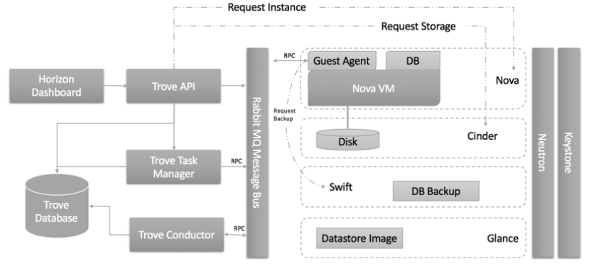
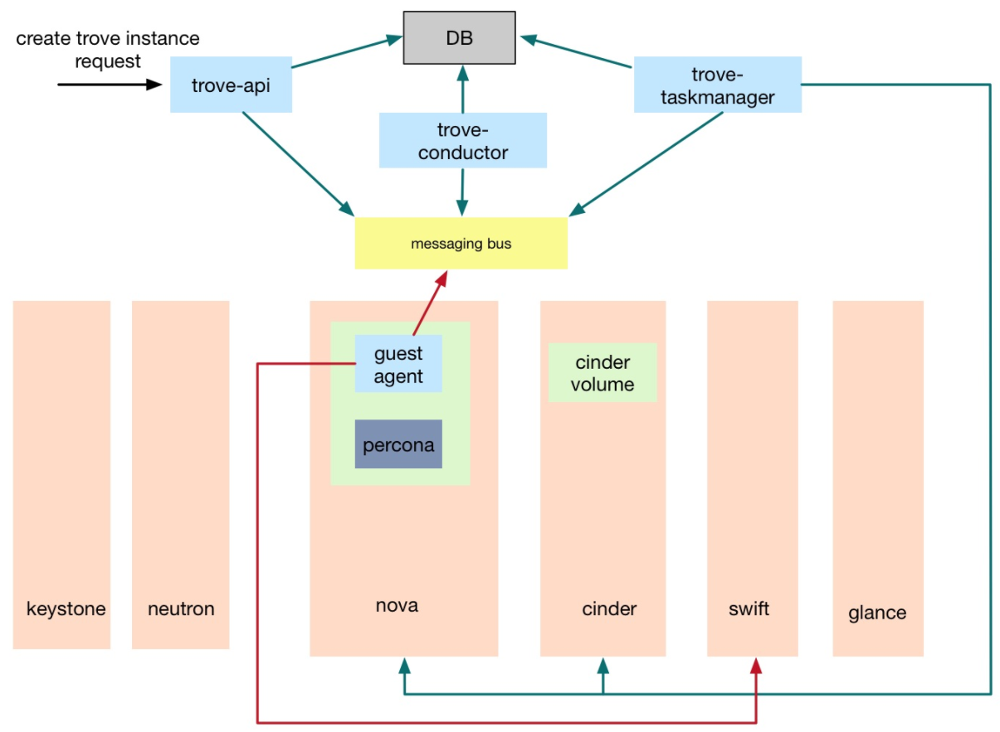

# Trove Deploy

2017/10/06

Trove 在生产环境中的部署率并不高，这源于trove 本身架构设计的局限性，本文给出了一种生产中的使用架构，并解释
trove在生产中使用时遇到的问题，以及如何克服。

## Trove 部署架构设计

Trove包含Trove-api，Trove-taskmanager，Trove-conductor和Trove-guestagent四个组件，组件之间的通信需求如下图所示:

trove的部署需要重点关注的几点

1. 我们的openstack环境是基于mitaka版本，trove项目使用ocata版本
2. 需要保证trove组件之间的rpc通信，trove与keystone，nova，cinder，swift间的API调用
3. 数据库实例需要在租户网络内，同时需要访问MQ和swift
4. trove-api，taskmanager和conductor的ha

最终的部署方案如下图所示：

网络设计图

## Trove 架构说明

Trove通过创建数据库实例来提供数据库服务，数据库实例就是运行数据库程序的openstack虚拟机。
Trove创建数据库实例的处理流程如下图所示：

1. trove-api收到请求之后通过MQ通知trove-taskmanager处理
2. trove-taskmanager调用nova-api创建虚拟机，调用cinder API创建卷
3. 数据库实例启动后运行trove-guestagent，guestagent通过MQ与trove-conductor通信，更新
4. 数据库实例的状态
5. 备份操作guestagent还会访问swift。

根据Trove部署架构图和网络规划图：

1. trove服务使用openstack原有的DB和MQ服务
2. trove-api，trove-taskmanager和trove-conductor以virtulenv的方式部署在控制节点，各启动三个做HA，
trove-api服务加入openstack服务haproxy。
3. trove-guestagent需要访问MQ和swift，但由于其处在租户VM内，为了防止租户VM入侵管理网，建立单独的trove管理网，
用虚拟机建立haproxy集群，作为guestagent访问openstack管理网的代理。
4. 由于每个haproxy节点都需要加入openstack管理网，为避免openstack管理网IP地址浪费，增加一个新的admin管理网，
如上图中的admin-mgmt network，admin-mgmt network与openstack管理网物理打通。haproxy节点加入admin-mgmt network。
5. trove管理网由admin创建，shared=True，禁用网关，名称使用统一的前缀trove-mgmt，IP地址前两位固定为10.50。
每三个trove管理网建立一个haproxy集群，每个haproxy节点会同时加入三个trove管理网，以及admin-mgmt network。
每个trove管理网的IP地址池预留前5个IP，也就是ip range为10.50.x.6 - 10.50.x.254，
使用10.50.x.5作为集群的VIP。