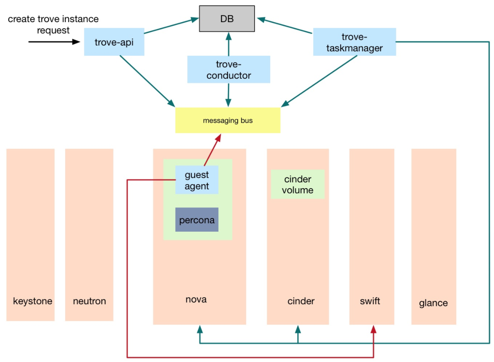

# trove HA
date: 2017-11-01T17:25:40+08:00

# trove 高可用测试

## 测试环境

使用openstack
allinone环境进行测试。分别启动三个trove-api，trove-conductor和trove-conductor服务，使用
不同的配置文件来模拟三个trove节点。
## 测试项目
## 功能测试
测试启动多个trove服务的情况下，trove功能是否能正常使用

1. 配置datastore
创建datastore，指定datastore version，注册datastore默认参数
2. 数据库实例
创建，删除
3. DB操作
database，user创建、删除。db访问。
4. 备份
创建备份，从backup恢复实例
5. 副本
创建副本，查看主从同步
6. 日志
开关日志功能，日志上传下载
目前测试镜像还不支持binlog，因此binlog暂未测试
7. 参数模板
创建，修改，应用，查看生效

经过测试，以上功能在高可用环境可以正常使用
## 高可用测试
创建实例后，down掉接受请求的taskmanager和conductor，进行后续db操作，备份操作，delete实例操作，功能正常，日志未报错。

恢复down掉的服务，重新创建实例，db操作，备份操作，delete实例操作，功能正常，日志未报错。

# Trove 高可用部署架构

## 1. 简介

本篇文档主要介绍Trove服务的高可用部署架构。

## 2. 部署架构

### 2.1 trove 处理流程

Trove通过创建数据库实例来提供数据库服务，数据库实例就是运行数据库程序的openstack虚拟机。

Trove创建数据库实例的处理流程如下图所示：



1. trove-api收到请求之后通过MQ通知trove-taskmanager处理
2. trove-taskmanager调用nova-api创建虚拟机，调用cinder API创建卷
3. 数据库实例启动后运行trove-guestagent，guestagent通过MQ与trove-conductor通信，更新
数据库实例的状态
4. 备份操作guestagent还会访问swift。

### 2.2 部署架构

trove的部署需要重点关注的几点

1. 我们的openstack环境是基于mitaka版本，trove项目使用ocata版本
2. 需要保证trove组件之间的rpc通信，trove与keystone，nova，cinder，swift间的API调用
3. 数据库实例需要在租户网络内，同时需要访问MQ和swift
4. trove-api，taskmanager和conductor的ha

最终确定的部署方案如下图所示：


网络设计图


1. trove服务使用openstack原有的DB和MQ服务
2. trove-api，trove-taskmanager和trove-conductor以virtulenv的方式部署在控制节点，各启动三个做HA，
trove-api服务加入openstack服务haproxy。
3. trove-guestagent需要访问MQ和swift，但由于其处在租户VM内，为了防止租户VM入侵管理网，建立单独的trove管理网，
用虚拟机建立haproxy集群，作为guestagent访问openstack管理网的代理。
4. 由于每个haproxy节点都需要加入openstack管理网，为避免openstack管理网IP地址浪费，增加一个新的admin管理网，
如上图中的admin-mgmt network，admin-mgmt network与openstack管理网物理打通。haproxy节点加入admin-mgmt network。
5. trove管理网由admin创建，shared=True，禁用网关，名称使用统一的前缀trove-mgmt，IP地址前两位固定为10.50。
每三个trove管理网建立一个haproxy集群，每个haproxy节点会同时加入三个trove管理网，以及admin-mgmt network。
每个trove管理网的IP地址池预留前5个IP，也就是ip range为10.50.x.6 - 10.50.x.254，
使用10.50.x.5作为集群的VIP。

## 3. trove 管理网及ha集群搭建过程
### 3.1 创建admin-mgmt network

admin-mgmt network与openstack管理网物理打通。网络节点和计算节点创建网桥，并将物理网卡加入网桥。
```
ovs-vsctl add-br br-vlan
ovs-vsctl add-port br-vlan eth3
```
修改neutron配置文件
```
# /etc/neutron/plugins/ml2/ml2.ini
[ml2_type_vlan]
network_vlan_ranges = xxx,physnet2:1:2015

# /etc/neutron/plugins/ml2/openvswitch_agent.ini
[ovs]
bridge_mappings = xxx,physnet2:br-vlan
```
重启neutron-server和neuron-openvswitch-agent使配置生效
```
systemctl restart neutron-server
systemctl restart neutron-openvswitch-agent
```
neutron创建admin-mgmt network，用admin创建vlan类型网络
```
neutron net-create --provider:network_type vlan --provider:physical_network physnet2 \
--provider:segmentation_id <vlan_id> admin-mgmt
```
注：以上命令中的参数根据实际情况调整。


### 3.2 创建trove 管理网

python-neutron需要8.1.2.30版本以上

trove管理网由admin来创建，shared=True，前缀默认使用trove-mgmt。如果要使用其它前缀，需要编辑/etc/neutron/neutron.conf，修改management section
下的trove_profix
```
[management]
trove_prefix = xxx
```
重启neutron-server
```
systemctl restart neutron-server
```
```
# 创建trove管理网和子网
neutron net-create trove-mgmt1 --shared
neutron net-create trove-mgmt2 --shared
neutron net-create trove-mgmt3 --shared
neutron subnet-create --name trove-mgmt1-subnet --no-gateway --allocation-pool start=10.50.0.6,end=10.50.0.254 trove-mgmt1 10.50.0.0/24
neutron subnet-create --name trove-mgmt2-subnet --no-gateway --allocation-pool start=10.50.1.6,end=10.50.1.254 trove-mgmt2 10.50.1.0/24
neutron subnet-create --name trove-mgmt3-subnet --no-gateway --allocation-pool start=10.50.2.6,end=10.50.2.254 trove-mgmt3 10.50.2.0/24
```
### 3.3 创建haproxy 集群

haproxy节点创建过程

1. 创建独立的安全组，放开vrrp协议。其它策略根据需要而定。

```
# 创建安全组trove-mgmt-group
# 放开vrrp协议，放开tcp 8080(swift)，tcp 5670-5672(rabbitmq)
neutron security-group-create --description 'Trove mgmt security group' trove-mgmt-group
neutron security-group-rule-create --protocol vrrp --remote-group-id trove-mgmt-group trove-mgmt-group
## neutron security-group-rule-create --protocol tcp --port_range_min 5670 --port_range_max 5672 trove-mgmt-group
## neutron security-group-rule-create --protocol tcp --port_range_min 8080 --port_range_max 8080 trove-mgmt-group
# 由于puppet部署ha集群的时候也需要通过tcp访问ha集群，所以ha节点安全组放开tcp
neutron security-group-rule-create --protocol tcp trove-mgmt-group
```
2.创建VM加入admin-mgmt network以及刚才创建的三个trove-mgmt network，使用上一步创建的安全组。

3.配置VM的三个trove-mgmt网络的Port，开启VIP的allowed-address-pair。

```
# 查询neutron port
neutron port-list --device-id <server_id>

# 对查询出来的属于trove管理网的三个port，分配开启相应的vip allowed-address-pair
neutron port-update <trove-mgm1-port_id> --allowed-address-pairs type=dict list=true ip_address=10.50.0.5
neutron port-update <trove-mgm1-port_id> --allowed-address-pairs type=dict list=true ip_address=10.50.1.5
neutron port-update <trove-mgm1-port_id> --allowed-address-pairs type=dict list=true ip_address=10.50.2.5
```
4.VM上安装ha软件，例如haproxy和keepalived。

5.重复2，3，4步骤配置集群其它节点。

### 3.4 配置文件参考

#### 3.4.1 haproxy 配置参考
```
global
    log         127.0.0.1 local2

    chroot      /var/lib/haproxy
    pidfile     /var/run/haproxy.pid
    maxconn     4000
    user        haproxy
    group       haproxy
    daemon

    # turn on stats unix socket
    stats socket /var/lib/haproxy/stats

defaults
    mode                    http
    log                     global
    option                  httplog
    option                  dontlognull
    option http-server-close
    option forwardfor       except 127.0.0.0/8
    option                  redispatch
    retries                 3
    timeout http-request    10s
    timeout queue           1m
    timeout connect         10s
    timeout client          1m
    timeout server          1m
    timeout http-keep-alive 10s
    timeout check           10s
    maxconn                 3000

listen swift 0.0.0.0:8080
    mode tcp
    option tcplog
    balance roundrobin
    server swift1 10.0.2.37:8080 check inter 5000 rise 2 fall 2

listen rabbitmq1 0.0.0.0:5670
    mode tcp
    option tcplog
    balance roundrobin
    server rabbit1 10.0.2.31:5672 check inter 5000 rise 2 fall 2

listen rabbitmq2 0.0.0.0:5671
    mode tcp
    option tcplog
    balance roundrobin
    server rabbit1 10.0.2.32:5672 check inter 5000 rise 2 fall 2

listen rabbitmq3 0.0.0.0:5672
    mode tcp
    option tcplog
    balance roundrobin
    server rabbit1 10.0.2.33:5672 check inter 5000 rise 2 fall 2
```
#### 3.4.2 keepalived 配置参考
```
# 主节点
global_defs {
    router_id LVS_DEVEL
}
vrrp_instance VI_1 {
    state MASTER
    interface eth1
    virtual_router_id 51
    priority 100
    advert_int 2
    authentication {
        auth_type PASS
        auth_pass 1111
    }
    virtual_ipaddress {
        10.50.0.5
    }
}

vrrp_instance VI_2 {
    state MASTER
    interface eth2
    virtual_router_id 51
    priority 100
    advert_int 2
    authentication {
        auth_type PASS
        auth_pass 1111
    }
    virtual_ipaddress {
        10.50.1.5
    }
}

vrrp_instance VI_3 {
    state MASTER
    interface eth3
    virtual_router_id 51
    priority 100
    advert_int 2
    authentication {
        auth_type PASS
        auth_pass 1111
    }
    virtual_ipaddress {
        10.50.2.5
    }
}
```
```
# 备节点
global_defs {
    router_id LVS_DEVEL
}
vrrp_instance VI_1 {
    state BACKUP
    interface eth1
    virtual_router_id 51
    priority 99
    advert_int 2
    authentication {
        auth_type PASS
        auth_pass 1111
    }
    virtual_ipaddress {
        10.50.0.5
    }
}

vrrp_instance VI_2 {
    state BACKUP
    interface eth2
    virtual_router_id 51
    priority 99
    advert_int 2
    authentication {
        auth_type PASS
        auth_pass 1111
    }
    virtual_ipaddress {
        10.50.1.5
    }
}

vrrp_instance VI_3 {
    state MASTER
    interface eth3
    virtual_router_id 51
    priority 99
    advert_int 2
    authentication {
        auth_type PASS
        auth_pass 1111
    }
    virtual_ipaddress {
        10.50.2.5
    }
}
```
#### 3.4.3 percona.cloudinit配置

percona.cloudinit脚本放在控制节点/etc/trove/cloudinit/目录下，用于向trove实例注入hosts配置
获取本机网卡IP，10.50开头的IP为trove管理网IP，末位改为5（VIP地址），VIP域名为proxy.polex.io，
写到/etc/hosts中
```
#!/bin/bash
ips=$(hostname -I)
prefix="10.50."
get_netprefix(){
  ip=$1
  if [[ $ip =~ 10\.50\..* ]];then
     grep proxy.polex.io /etc/hosts || echo $ip | awk -F '.' '{print $1"."$2."."$3".5   proxy.polex.io"}' >>/etc/hosts
     exit 0
  fi
}
for ip in ${ips};do
  get_netprefix $ip
done
```

## 4. 具体配置
### 4.1 预发环境

admin管理网手动创建

| 名称 | id | vlan_id| 子网 | 网关 |
|------|----|--------|-----|------|
|admin-mgmt	| |	1029| 10.0.29.0/24	|10.0.29.1


已建trove管理网

|名称|子网|vip|
|---|----|---|
|trove-mgmt1|10.50.0.0/24|	10.50.0.5|
|trove-mgmt2|	10.50.1.0/24|	10.50.1.5|
|trove-mgmt3|	10.50.2.0/24|	10.50.2.5|

一个trove-mgmt network多个subnet的网络，neutron使用一个dhcp opts文件，包含三个subnet的路由信息，这样VM dhcp到的route
table，一块网卡上三个subnet的路由都会有，这样通信就会出现问题。

|           |               |                    |     |      |        |       |      |
|-----------|---------------|--------------------|-----|------|--------|-------|------|
|10.50.0.0  |     0.0.0.0   |      255.255.255.0 |  U  |   0  |    0   |     0 |eth2 |
|10.50.0.0  |    0.0.0.0    |    255.255.255.0   |U     |100   | 0    |    0 | eth1 |
|10.50.0.0  |    0.0.0.0    |     255.255.255.0  | U     |101   | 0  |      0 |eth3 |
截止到目前还没有解决。预发的部署可以先只建一个subnet的trove-mgmt network。

### 4.2 南数环境

admin管理网已经存在

| 名称 |id | vlan_id |子网 | 网关 |
|---|---|---|---|---|
| haihangyun-ceph | 85d905a3-62ba-45c2-8f27-2733e1f88204| 	1611| 	10.48.108.0/24	|F|

