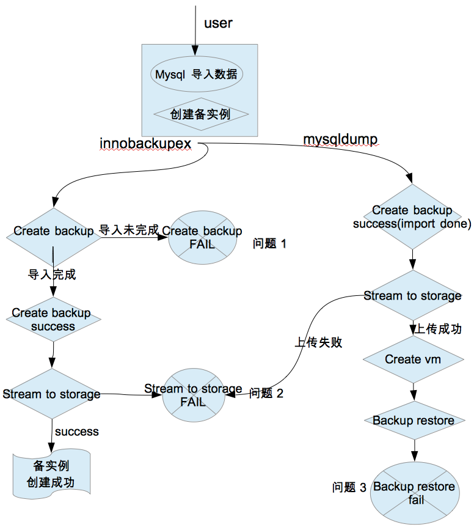

# trove import data issue
date: 2017-11-01T18:18:30+08:00

# 问题
调查并解决导入数据时创建备实例失败的问题-如果用户在导入数据时创建备实例，备实例创建需要很长时间，而且可能会失败。
# 分析
## 备实例创建过程
### 第一步：基于现有实例创建备份，存储到swift

由guest agent来具体实现

默认的backup_strategy 是 InnoBackupEx（另外支持MySQLDump）,然后 用gzip 进行压缩,用openssl aes_cbc key 进行加密,用snet 发送backup files

备份时执行命令如下：
```
innobackupex --stream=xbstream   --user=os_admin --password=26TywKafqrYpraAMEJMuz4jAtyzWatKJsaBZ /var/lib/mysql/data 2>/tmp/innobackupex.log | gzip | openssl enc -aes-256-cbc -salt -pass pass:default_aes_cbc_key
```

通过检查 /tmp/innobackupex.log 中查找“completed OK!” 来确定是否备份完毕

若用MySQLDump来备份时，执行如下命令：
```
mysqldump --all-databases  --opt --password=26TywKafqrYpraAMEJMuz4jAtyzWatKJsaBZ -u os_admin 2>/tmp/mysqldump.log | gzip | openssl enc -aes-256-cbc -salt -pass pass:default_aes_cbc_key
```
### 第二步：通过nova创建新的实例
### 第三步：加载backup （backup restore）
```
 Collapse source
'sudo innobackupex'
' --defaults-file=%(restore_location)s/backup-my.cnf'
' --ibbackup=xtrabackup'
' --apply-log'
' %(restore_location)s'
' 2>/tmp/innoprepare.log'

sudo xbstream -x -C %(restore_location)s
通过检查/tmp/innoprepare.log 来确定是否恢复成功
```
### 第四步：复制策略（）将执行命令来配置复制的副本连接到主节点

默认的副本策略是：MysqlGTIDReplication
```
"change_master_cmd = (
    "CHANGE MASTER TO MASTER_HOST='%(host)s', "
    "MASTER_PORT=%(port)s, "
    "MASTER_USER='%(user)s', "
    "MASTER_PASSWORD='%(password)s', "
    "MASTER_AUTO_POSITION=1, "
    "MASTER_CONNECT_RETRY=15" %
    {
        'host': snapshot['master']['host'],
        'port': snapshot['master']['port'],
        'user': logging_config['replication_user']['name'],
        'password': logging_config['replication_user']['password']
    })
service.execute_on_client(change_master_cmd)
service.start_slave()
```
## 测试场景1：导入数据时创建备实例
### 创建主实例，db中插入大量数据，然后导出
```
 Collapse source
# trove create dxl-test 100 --size 10 --nic net-id=b2021cce-15f7-4d5b-9ee2-088a82bc48a6
# neutron security-group-rule-create  --protocol tcp --port-range-min 22 --port-range-max 22 --direction ingress --remote-ip-prefix 0.0.0.0/0 HHY-TROVE-SecGroup_39234d6e-34ad-4fdb-b614-2d95596a3b58
#ip netns exec qdhcp-b2021cce-15f7-4d5b-9ee2-088a82bc48a6  ssh -i trove_id_rsa ubuntu@192.168.101.72

# trove database-create dxl-test test01
# trove user-create dxl-test user01 user01  --databases test01
# neutron floatingip-associate dce07ca2-3876-46c3-b821-cacc4e8303f8 7e208c2b-c70a-488a-8c1e-02ce7797ac37

插入大量数据
/var/lib/mysql/data/test01
root@dxl-test:/var/lib/mysql/data/test01# tail employee.txt
300,Mayla, Jones,Technology,7000
mysql>use test01;
mysql>create table employee(id int, lastName varchar(255), firstName varchar(255), salary int)
ubuntu@dxl-test:~$ cat write-data.sh
i=1
while(($i<100000));
do
mysql -e "LOAD DATA INFILE 'employee.txt' INTO TABLE test01.employee;"
i=`expr $i + 1`
done

通过load data infile的方式快速插入大量数据，需要配置my.cnf,然后重启mysql
[mysqld]
secure-file-priv = ""

Service mysql stop
Service mysql start

在90上导出数据库
mysqldump -u user01 -p db1  -h 172.24.4.240  > db1.sql
密码：user01
导出的文件大小为1.2G
```
### 导入数据，同时创建备实例
```
 Collapse source
#trove database-create dxl-test db3
#trove user-grant-access dxl-test user01 db3
#mysql -u user01  -p db3  -h 172.24.4.240  < db1.sql
#trove create dxl-test-mirror  105 --size 10 --nic net-id=b2021cce-15f7-4d5b-9ee2-088a82bc48a6 —replica_of  dxl-test
```
注：默认bakcup strategy是 InnoBackupEx

#### 问题1: create backup failed（导入未完成）
```
 Collapse source
问题1: 出现在创建backup阶段，backup 是failed，原因如下：
f4df5a32-2c75-4567-9582-e962f134e2b2 | 842ddd86-664a-4bb5-a875-68b7f38e90d6 | HHY-TROVE-Backup-477dc118-f2b9-41ae-82b5-ab8290359516 | BUILDING      | None      | 2017-08-16T08:26:50
MariaDB [trove]> select * from backups where id="f4df5a32-2c75-4567-9582-e962f134e2b2"\G;
*************************** 1. row ***************************
                  id: f4df5a32-2c75-4567-9582-e962f134e2b2
               name: HHY-TROVE-Backup-477dc118-f2b9-41ae-82b5-ab8290359516
         description: Backup image used to initialize replication slave
            location: http://172.24.4.1:8080/v1/AUTH_42ee53fa480f49149ce5c3df4a953a6b/database_backups/f4df5a32-2c75-4567-9582-e962f134e2b2.xbstream.gz.enc
         backup_type: InnoBackupEx
               size: 1.9
           tenant_id: 42ee53fa480f49149ce5c3df4a953a6b
               state: FAILED
         instance_id: 842ddd86-664a-4bb5-a875-68b7f38e90d6
            checksum: 6317be8414fa20e63fe6fefb101ca033
    backup_timestamp: NULL
             deleted: 1
             created: 2017-08-16 08:26:37
             updated: 2017-08-16 08:28:49
          deleted_at: 2017-08-16 08:28:49
           parent_id: NULL
datastore_version_id: 1218df1a-4b32-434a-8f56-8feb7eec4bec

Cat /tmp/innobackupex.log
170816 08:27:50 >> log scanned up to (3738601284)
xtrabackup: error: log block numbers mismatch:
xtrabackup: error: expected log block no. 8039620, but got no. 8244412 from the log file.
xtrabackup: error: it looks like InnoDB log has wrapped around before xtrabackup could process all records due to either log copying being too slow, or  log files being too small.
xtrabackup: Error: xtrabackup_copy_logfile() failed.
```
#### 解决方法

错误的意思是：XtraBackup在顺序拷贝完redo log末尾的数据后，重新从redo log的起始位置去拷贝时，发现起始位置的log block no.与刚才尾部的no.不连续

原因可能是：在XtraBackup处理完所有的redo log数据之前，redo log起始位置的数据就被后续写入的log覆盖掉了。原因可能是拷贝redo log的速度太慢了，或者redo log文件的大小设置太小了。

结合从网上找到的资料，引起以上问题的可能原因如下：
1. redo log的文件大小（innodb_log_file_size*innodb_log_files_in_group）设置过小；
2. XtraBackup拷贝redo log的速度有些慢（可能受其他的系统任务的比较频繁的磁盘IO影响）；
3. 如果备份文件是存储在远程文件系统上，则还有可能是受网络带宽较小或拥堵导致；

innodb_log_files_in_group = 2

innodb_log_file_size=50M

从以上设置可以看出，percona 设置的redo log大小是2 * 50M，文件大小设置的有些小

解决方法
1. 增加 innodb_log_file_size=64M

#### 问题2: 数据导入完成后，创建备份成功，上传的到swift失败
```
 Collapse source
(trove) [root@trove-bm.0.example.polex.io ~ ]$ trove show dxl-test-mirror
+-------------------------+---------------------------------------------------------------------------------------------------------------------------------------------------+
| Property                | Value                                                                                                                                             |
+-------------------------+---------------------------------------------------------------------------------------------------------------------------------------------------+
| created                 | 2017-08-17T02:40:38Z                                                                                                                              |
| datastore               | percona                                                                                                                                           |
| datastore_version       | percona-5.6.33                                                                                                                                    |
| encrypted_rpc_messaging | True                                                                                                                                              |
| fault                   | Error creating replication snapshot from instance 842ddd86-664a-4bb5-a875-68b7f38e90d6 for new replica 4d5cb62c-b970-4dd2-a32e-af27f855d1c1.      |
|                         | An error occurred communicating with the guest:                                                                                                   |
|                         |     put_object('database_backups', u'6dcf228e-7079-4ce6-b8de-6d...                                                                                |
| fault_date              | 2017-08-17T02:46:36                                                                                                                               |
| fault_details           | Server type: taskmanager                                                                                                                          |
|                         | Traceback (most recent call last):                                                                                                                |
|                         |   File "/opt/stack/.virtualenvs/trove/lib/python2.7/site-packages/trove/taskmanager/manager.py", line 395, in create_instance                     |
|                         |     locality)                                                                                                                                     |
|                         |   File "/opt/stack/.virtualenvs/trove/lib/python2.7/site-packages/trove/taskmanager/manager.py", line 360, in _create_instance                    |
                         |     backup_id, volume_type, modules)                                                                                                              |
|                         |   File "/opt/stack/.virtualenvs/trove/lib/python2.7/site-packages/trove/taskmanager/manager.py", line 323, in _create_replication_slave           |
|                         |     replica_number=replica_number)                                                                                                                |
|                         |   File "/opt/stack/.virtualenvs/trove/lib/python2.7/site-packages/trove/taskmanager/models.py", line 679, in get_replication_master_snapshot      |
|                         |     self._log_and_raise(e_create, msg_create, err)                                                                                                |
|                         |   File "/opt/stack/.virtualenvs/trove/lib/python2.7/site-packages/trove/taskmanager/models.py", line 982, in _log_and_raise                       |
|                         |     raise TroveError(message=full_message)                                                                                                        |
|                         | TroveError:                                                                                                                                       |
|                         |     Error creating replication snapshot from instance 842ddd86-664a-4bb5-a875-68b7f38e90d6 for new replica 4d5cb62c-b970-4dd2-a32e-af27f855d1c1.  |
|                         | An error occurred communicating with the guest:                                                                                                   |
|                         |     put_object('database_backups', u'6dcf228e-7079-4ce6-b8de-6d8d2e22ef72_00000000', ...) failure and no ability to reset contents for reupload.. |
                         |                                                                                                                                                   |
| flavor                  | 105                                                                                                                                               |
| id                      | 4d5cb62c-b970-4dd2-a32e-af27f855d1c1                                                                                                              |
| name                    | dxl-test-mirror                                                                                                                                   |
| region                  | RegionOne                                                                                                                                         |
| replica_of              | 842ddd86-664a-4bb5-a875-68b7f38e90d6                                                                                                              |
| status                  | ERROR                                                                                                                                             |
| updated                 | 2017-08-17T02:46:36Z                                                                                                                              |
| volume                  | 10                                                                                                                                                |
| volume_id               | None                                                                                                                                              |
+-------------------------+---------------------------------------------------------------------------------------------------------------------------------------------------+

2017-08-17 02:46:35.020 13831 INFO swiftclient [-] REQ: curl -i http://172.24.4.1:8080/v1/AUTH_42ee53fa480f49149ce5c3df4a953a6b/database_backups/6dcf228e-7079-4ce6-b8de-6d8d2e22ef72_00000000 -X PUT -H "Content-Type: " -H "X-Auth-Token: 0ea8efa6dd23433b..."
2017-08-17 02:46:35.020 13831 INFO swiftclient [-] RESP STATUS: 408 Request Timeout
2017-08-17 02:46:35.021 13831 INFO swiftclient [-] RESP HEADERS: {u'Date': u'Thu, 17 Aug 2017 02:42:05 GMT', u'Content-Length': u'116', u'Content-Type': u'text/html; charset=UTF-8', u'X-Trans-Id': u'tx4ebbc65c65114b22867a6-0059950228'}
2017-08-17 02:46:35.021 13831 INFO swiftclient [-] RESP BODY: <html><h1>Request Timeout</h1><p>The server has waited too long for the request to be sent by the client.</p></html>
2017-08-17 02:46:36.021 13831 ERROR trove.guestagent.backup.backupagent [-] Error saving backup: 6dcf228e-7079-4ce6-b8de-6d8d2e22ef72.
2017-08-17 02:46:36.021 13831 ERROR trove.guestagent.backup.backupagent Traceback (most recent call last):
2017-08-17 02:46:36.021 13831 ERROR trove.guestagent.backup.backupagent   File "/home/ubuntu/trove/trove/guestagent/backup/backupagent.py", line 91, in stream_backup_to_storage
2017-08-17 02:46:36.021 13831 ERROR trove.guestagent.backup.backupagent     metadata=meta)
2017-08-17 02:46:36.021 13831 ERROR trove.guestagent.backup.backupagent   File "/home/ubuntu/trove/trove/common/strategies/storage/swift.py", line 149, in save
2017-08-17 02:46:36.021 13831 ERROR trove.guestagent.backup.backupagent     stream_reader)
2017-08-17 02:46:36.021 13831 ERROR trove.guestagent.backup.backupagent   File "/usr/local/lib/python2.7/dist-packages/swiftclient/client.py", line 1824, in put_object
2017-08-17 02:46:36.021 13831 ERROR trove.guestagent.backup.backupagent     response_dict=response_dict)
2017-08-17 02:46:36.021 13831 ERROR trove.guestagent.backup.backupagent   File "/usr/local/lib/python2.7/dist-packages/swiftclient/client.py", line 1710, in _retry
2017-08-17 02:46:36.021 13831 ERROR trove.guestagent.backup.backupagent     reset_func(func, *args, **kwargs)
2017-08-17 02:46:36.021 13831 ERROR trove.guestagent.backup.backupagent   File "/usr/local/lib/python2.7/dist-packages/swiftclient/client.py", line 1804, in _default_reset
2017-08-17 02:46:36.021 13831 ERROR trove.guestagent.backup.backupagent     % (container, obj))
2017-08-17 02:46:36.021 13831 ERROR trove.guestagent.backup.backupagent ClientException: put_object('database_backups', u'6dcf228e-7079-4ce6-b8de-6d8d2e22ef72_00000000', ...) failure and no ability to reset contents for reupload.
2017-08-17 02:46:36.021 13831 ERROR trove.guestagent.backup.backupagent
2017-08-17 02:46:36.054 13831 INFO trove.guestagent.backup.backupagent [-] Completed backup 6dcf228e-7079-4ce6-b8de-6d8d2e22ef72.
2017-08-17 02:46:36.054 13831 DEBUG trove.conductor.api [-] Making async call to cast update_backup for instance: 842ddd86-664a-4bb5-a875-68b7f38e90d6 update_backup /home/ubuntu/trove/trove/conductor/api.py:85
2017-08-17 02:46:36.056 13831 DEBUG oslo_messaging._drivers.amqpdriver [-] CAST unique_id: 3e95c687b9094747bd120aa6cac6e86b exchange 'trove' topic 'trove-conductor' _send /usr/local/lib/python2.7/dist-packages/oslo_messaging/_drivers/amqpdriver.py:442
2017-08-17 02:46:36.089 13831 DEBUG trove.guestagent.backup.backupagent [-] Updated state for 6dcf228e-7079-4ce6-b8de-6d8d2e22ef72 to {'state': 'FAILED', 'backup_id': u'6dcf228e-7079-4ce6-b8de-6d8d2e22ef72', 'size': 4.86}. stream_backup_to_storage /home/ubuntu/trove/trove/guestagent/backup/backupagent.py:126
2017-08-17 02:46:36.089 13831 ERROR oslo_messaging.rpc.server [-] Exception during message handling
2017-08-17 02:46:36.089 13831 ERROR oslo_messaging.rpc.server Traceback (most recent call last):
2017-08-17 02:46:36.089 13831 ERROR oslo_messaging.rpc.server   File "/usr/local/lib/python2.7/dist-packages/oslo_messaging/rpc/server.py", line 155, in _process_incoming
2017-08-17 02:46:36.089 13831 ERROR oslo_messaging.rpc.server     res = self.dispatcher.dispatch(message)
2017-08-17 02:46:36.089 13831 ERROR oslo_messaging.rpc.server   File "/usr/local/lib/python2.7/dist-packages/oslo_messaging/rpc/dispatcher.py", line 222, in dispatch
2017-08-17 02:46:36.089 13831 ERROR oslo_messaging.rpc.server     return self._do_dispatch(endpoint, method, ctxt, args)
2017-08-17 02:46:36.089 13831 ERROR oslo_messaging.rpc.server   File "/usr/local/lib/python2.7/dist-packages/oslo_messaging/rpc/dispatcher.py", line 192, in _do_dispatch
2017-08-17 02:46:36.089 13831 ERROR oslo_messaging.rpc.server     result = func(ctxt, **new_args)
2017-08-17 02:46:36.089 13831 ERROR oslo_messaging.rpc.server   File "/usr/local/lib/python2.7/dist-packages/osprofiler/profiler.py", line 153, in wrapper
2017-08-17 02:46:36.089 13831 ERROR oslo_messaging.rpc.server     return f(*args, **kwargs)
2017-08-17 02:46:36.089 13831 ERROR oslo_messaging.rpc.server   File "/home/ubuntu/trove/trove/guestagent/datastore/mysql_common/manager.py", line 360, in get_replication_snapsho
2017-08-17 02:46:36.089 13831 ERROR oslo_messaging.rpc.server     context, app, None, snapshot_info)
2017-08-17 02:46:36.089 13831 ERROR oslo_messaging.rpc.server   File "/home/ubuntu/trove/trove/guestagent/strategies/replication/mysql_base.py", line 109, in snapshot_for_replication
2017-08-17 02:46:36.089 13831 ERROR oslo_messaging.rpc.server     incremental_runner=self.repl_incr_backup_runner)
2017-08-17 02:46:36.089 13831 ERROR oslo_messaging.rpc.server   File "/home/ubuntu/trove/trove/guestagent/backup/backupagent.py", line 153, in execute_backup
2017-08-17 02:46:36.089 13831 ERROR oslo_messaging.rpc.server     parent_metadata, extra_opts)
2017-08-17 02:46:36.089 13831 ERROR oslo_messaging.rpc.server   File "/home/ubuntu/trove/trove/guestagent/backup/backupagent.py", line 91, in stream_backup_to_storage
2017-08-17 02:46:36.089 13831 ERROR oslo_messaging.rpc.server     metadata=meta)
2017-08-17 02:46:36.089 13831 ERROR oslo_messaging.rpc.server   File "/home/ubuntu/trove/trove/common/strategies/storage/swift.py", line 149, in save
2017-08-17 02:46:36.089 13831 ERROR oslo_messaging.rpc.server     stream_reader)
2017-08-17 02:46:36.089 13831 ERROR oslo_messaging.rpc.server   File "/usr/local/lib/python2.7/dist-packages/swiftclient/client.py", line 1824, in put_object
2017-08-17 02:46:36.089 13831 ERROR oslo_messaging.rpc.server     response_dict=response_dict)
2017-08-17 02:46:36.089 13831 ERROR oslo_messaging.rpc.server   File "/usr/local/lib/python2.7/dist-packages/swiftclient/client.py", line 1710, in _retry
2017-08-17 02:46:36.089 13831 ERROR oslo_messaging.rpc.server     reset_func(func, *args, **kwargs)
2017-08-17 02:46:36.089 13831 ERROR oslo_messaging.rpc.server   File "/usr/local/lib/python2.7/dist-packages/swiftclient/client.py", line 1804, in _default_reset
2017-08-17 02:46:36.089 13831 ERROR oslo_messaging.rpc.server     % (container, obj))
2017-08-17 02:46:36.089 13831 ERROR oslo_messaging.rpc.server ClientException: put_object('database_backups', u'6dcf228e-7079-4ce6-b8de-6d8d2e22ef72_00000000', ...) failure and no ability to reset contents for reupload.
2017-08-17 02:46:36.089 13831 ERROR oslo_messaging.rpc.server
2017-08-17 02:46:36.107 13831 DEBUG oslo_messaging._drivers.amqpdriver [-] sending reply msg_id: 40415aef266643f29f9764154591377a reply queue: reply_e2fc9fd4191442d4943c206b4f90453a time elapsed: 355.773112647s _send_reply /usr/local/lib/python2.7/dist-packages/oslo_messaging/_drivers/amqpdriver.py:73
```

### 调研：mysqldump和innobackupex 备份原理和性能对比

由于问题1，所以调研下不同的备份方式在导入数据时，是否都会失败，以及效率。见mysql 备份(MySQLDump and InnoBackupEx)

## 测试场景2: 导入数据时创建备实例(mysqldump方式)
```
修改trove-guestagent.conf:
[percona]
backup_strategy = MySQLDump
backup_runner = trove.guestagent.backup.backup_types.MySQLDump
service trove-guest restart
```
注：由于trove hard code创建备实例时，用innobackupex 备份，所以需要修改源码：strategies/replication/mysql_base.py 中将InnoBackupEx 修改成 MySQLDump   OS-667 - trove 创建备实例，backup_strategy 支持mysqldump CLOSED

用mysqldump的方式，备份总是能创建成功，但是要等导入数据完成之后？创建完成时，上传到swift 时遇到问题2:The server has waited too long for the request to be sent by the client

## 问题3: backup restore fail   OS-668 - mysqldump 备份restore 失败 CLOSED
```
 Collapse source
mysqldump 备份和恢复测试 // Failed
2017-08-17 05:58:06.902 935 ERROR oslo_messaging.rpc.server [-] Exception during message handling
2017-08-17 05:58:06.902 935 ERROR oslo_messaging.rpc.server Traceback (most recent call last):
2017-08-17 05:58:06.902 935 ERROR oslo_messaging.rpc.server   File "/usr/local/lib/python2.7/dist-packages/oslo_messaging/rpc/server.py", line 155, in _process_incoming
2017-08-17 05:58:06.902 935 ERROR oslo_messaging.rpc.server     res = self.dispatcher.dispatch(message)
2017-08-17 05:58:06.902 935 ERROR oslo_messaging.rpc.server   File "/usr/local/lib/python2.7/dist-packages/oslo_messaging/rpc/dispatcher.py", line 222, in dispatch
2017-08-17 05:58:06.902 935 ERROR oslo_messaging.rpc.server     return self._do_dispatch(endpoint, method, ctxt, args)
2017-08-17 05:58:06.902 935 ERROR oslo_messaging.rpc.server   File "/usr/local/lib/python2.7/dist-packages/oslo_messaging/rpc/dispatcher.py", line 192, in _do_dispatch
2017-08-17 05:58:06.902 935 ERROR oslo_messaging.rpc.server     result = func(ctxt, **new_args)
2017-08-17 05:58:06.902 935 ERROR oslo_messaging.rpc.server   File "/usr/local/lib/python2.7/dist-packages/osprofiler/profiler.py", line 153, in wrapper
2017-08-17 05:58:06.902 935 ERROR oslo_messaging.rpc.server     return f(*args, **kwargs)
2017-08-17 05:58:06.902 935 ERROR oslo_messaging.rpc.server   File "/home/ubuntu/trove/trove/guestagent/datastore/manager.py", line 281, in prepare
2017-08-17 05:58:06.902 935 ERROR oslo_messaging.rpc.server     cluster_config, snapshot, modules)
017-08-17 05:58:06.902 935 ERROR oslo_messaging.rpc.server   File "/home/ubuntu/trove/trove/guestagent/datastore/manager.py", line 296, in _prepare
2017-08-17 05:58:06.902 935 ERROR oslo_messaging.rpc.server     cluster_config, snapshot)
2017-08-17 05:58:06.902 935 ERROR oslo_messaging.rpc.server   File "/usr/local/lib/python2.7/dist-packages/osprofiler/profiler.py", line 153, in wrapper
2017-08-17 05:58:06.902 935 ERROR oslo_messaging.rpc.server     return f(*args, **kwargs)
2017-08-17 05:58:06.902 935 ERROR oslo_messaging.rpc.server   File "/home/ubuntu/trove/trove/guestagent/datastore/mysql_common/manager.py", line 248, in do_prepare
2017-08-17 05:58:06.902 935 ERROR oslo_messaging.rpc.server     mount_point + "/data", app)
2017-08-17 05:58:06.902 935 ERROR oslo_messaging.rpc.server   File "/home/ubuntu/trove/trove/guestagent/datastore/mysql_common/manager.py", line 206, in _perform_restore
2017-08-17 05:58:06.902 935 ERROR oslo_messaging.rpc.server     backup.restore(context, backup_info, restore_location)
2017-08-17 05:58:06.902 935 ERROR oslo_messaging.rpc.server   File "/home/ubuntu/trove/trove/guestagent/backup/__init__.py", line 45, in restore
2017-08-17 05:58:06.902 935 ERROR oslo_messaging.rpc.server     return AGENT.execute_restore(context, backup_info, restore_location)
2017-08-17 05:58:06.902 935 ERROR oslo_messaging.rpc.server   File "/home/ubuntu/trove/trove/guestagent/backup/backupagent.py", line 172, in execute_restore
2017-08-17 05:58:06.902 935 ERROR oslo_messaging.rpc.server     content_size = runner.restore()
2017-08-17 05:58:06.902 935 ERROR oslo_messaging.rpc.server   File "/home/ubuntu/trove/trove/guestagent/strategies/restore/base.py", line 74, in restore
2017-08-17 05:58:06.902 935 ERROR oslo_messaging.rpc.server     content_length = self._run_restore()
2017-08-17 05:58:06.902 935 ERROR oslo_messaging.rpc.server   File "/home/ubuntu/trove/trove/guestagent/strategies/restore/base.py", line 79, in _run_restore
2017-08-17 05:58:06.902 935 ERROR oslo_messaging.rpc.server     return self._unpack(self.location, self.checksum, self.restore_cmd)
2017-08-17 05:58:06.902 935 ERROR oslo_messaging.rpc.server   File "/home/ubuntu/trove/trove/guestagent/strategies/restore/base.py", line 88, in _unpack
2017-08-17 05:58:06.902 935 ERROR oslo_messaging.rpc.server     process.stdin.write(chunk)
2017-08-17 05:58:06.902 935 ERROR oslo_messaging.rpc.server   File "/usr/lib/python2.7/socket.py", line 324, in write
2017-08-17 05:58:06.902 935 ERROR oslo_messaging.rpc.server     self.flush()
2017-08-17 05:58:06.902 935 ERROR oslo_messaging.rpc.server   File "/usr/lib/python2.7/socket.py", line 303, in flush
2017-08-17 05:58:06.902 935 ERROR oslo_messaging.rpc.server     self._sock.sendall(view[write_offset:write_offset+buffer_size])
2017-08-17 05:58:06.902 935 ERROR oslo_messaging.rpc.server   File "/usr/local/lib/python2.7/dist-packages/eventlet/greenio/py2.py", line 200, in sendall
2017-08-17 05:58:06.902 935 ERROR oslo_messaging.rpc.server     raise IOError(*e.args)
2017-08-17 05:58:06.902 935 ERROR oslo_messaging.rpc.server IOError: [Errno 32] Broken pipe
2017-08-17 05:58:06.902 935 ERROR oslo_messaging.rpc.server
2017-08-17 05:58:40.605 935 DEBUG oslo_service.periodic_task [-] Running periodic task Manager.update_status run_periodic_tasks /usr/local/lib/python2.7/dist-packages/oslo_service/periodic_task.py:215
```
## 测试场景3: mysql备份(innobackupex 和 mysqldump 性能对比)
## 测试场景4: swift上传速度测试
## 结论



通过以上测试和分析，发现导入数据时创建备实例，问题出在：

1. innobackupex 备份错误（问题1）
解决方案:
mysqldump 可能会遇到用备份搭建备实例，数据库不一致的坑，或者数据恢复恢复失败的坑，因此建议对于使用innobackupex备份的生产环境，要执行DDL语句，也需要避开备份时间。
 对生产库的DDL操作、大事务、或者长时间锁表的操作，一定要避开备份时间，否则，你懂的。
2. mysqldump 太慢
3. mysqldump 备份 restore 出错（问题3）
4. swift 上传失败（问题2）